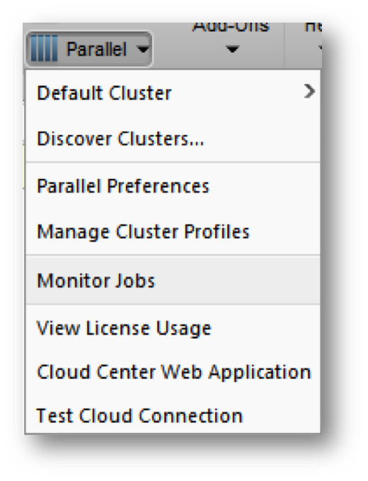

# MATLAB 

SNIC provides a nationwide set resources with the MATLAB Distributed Computing Server (MDCS) installed. At each respective SNIC centra the hosting university MATLAB licenses and toolboxes are available for use. 
 
The MATLAB versions available at LUNARC are:

    Version        Module name
    
    R2014a         matlab/8.3
    R2014b         matlab/8.4
    R2015a         matlab/8.5
    R2015b         matlab/8.6
    R2016a         matlab/8.7  (available on Aurora only)
    R2017a         matlab/2017a
    R2020a        matlab/2020a
    R2020b        matlab/2020b

## Running MATLAB on login-node 
MATLAB can be used on the login-nodes (either using LUNARC HPC Desktop i.e. ThinLinc. Or using SSH) Please note that as these are shared resources excessive use of MATLAB on the login-nodes will prevent other users from using the resources. 
As MATLAB by default will use as many threads (cores) it possibly can, any user who is to use MATLAB on the login-nodes MUST start matlab with the option "-singleCompThread" thus preventing MATLAB from using more that one thread.
This will NOT prevent matlab from utilizing the MATLAB Distributed Computing Server (MDCS) with which any number of cores can be used for computations.

To start MATLAB on a login node use: 

    matlab -singleCompThread

On the LUNARC HPC Desktop (Thinlinc) MATLAB R2016a as well as MATLAB R2017a are available via the Applications menu. Starting MATLAB from the menue automatically will set the -singleCompThread flag. This is now the recommended way to start MATLAB on the LUNARC HPC Desktop.

<!--- At LUNARC the MATLAB installation R2014a (also known as 8.3) is the **only** version available for use with MDCS. If any of the newer versions are used, submission to the batch queue from within MATLAB is not possible .

Versions newer than R2014a can use PCT at LUNARC but ONLY within a single node and ONLY by writing a batch script where MATLAB is run with a MATLAB script. Note that MATLAB will be able to use the PCT on the cores of this single node using the "local" profile.

## Non-MDCS submissions

Using MATLAB with versions newer than R2014a requires the user to write a batch script and a MATLAB script. An example SBATCH-script to start MATLAB using the batch system follow below. 

    #!/bin/bash
    #
    # job time, change for what your job requires   
    #SBATCH -t 00:10:00
    #
    # project ID if needed
    #SBATCH -A <your-project-ID>
    #
    # job name
    #SBATCH -J MATLAB_job
    #
    # filenames stdout and stderr - customise, include %j
    #SBATCH -o process_%j.out
    #SBATCH -e process_%j.err
    # Can only use one node
    #SBATCH -N 1
    # Make sure that you are the only one using the node. If not used MATLAB will only see 1 core 
    #SBATCH --exclusive
    
    # write this script to stdout-file - useful for scripting errors
    cat $0

    # load the modules required for you program
    # customise for your program replacing X with desired version
    module load matlab/8.X

    # copy the input data and program to node local disk
    # customise for your input file(s) and program name
    cp -p input.dat program.m $SNIC_TMP

    # change to the execution directory
    cd $SNIC_TMP

    # run the program
    # customise for your program name and add arguments if required
    matlab < program.m

    # rescue the results to the submission directory
    # customise for your result file(s)
    cp -p result.dat $SLURM_SUBMIT_DIR
    
Keep in mind that you as the user must make sure that any data produced is saved explicitly within the script as they otherwise will be lost.

## Using PCT

In R2014a of MATLAB the queueing system is accessible from within MATLAB. To set up use of the system the user must first run 

    configCluster

This will prepare the users profile for use of the MATLAB MDCS. This ONLY needs to be done once per user and MATLAB version. 
Having prepared the profile the user then as a minimum need to give information on the name of the users project and requested walltime for the users programs to run.

    ClusterInfo.setProjectName('SNIC2016-X-Y')
    ClusterInfo.setWallTime('XX:YY:ZZ')
    
If a particular queue is requested (for instance to request nodes with larger memory footprint) this can be set as shown below:

    ClusterInfo.setQueueName('name-of-queue')
    
The ClusterInfo command have a number of parameters that can be set

    Arch
    ClusterHost
    Constraint
    DataParallelism
    DebugMessagesTurnedOn
    DiskSpace
    EmailAddress
    GpusPerNode
    MemUsage
    PrivateKeyFile
    PrivateKeyFileHasPassPhrase
    ProcsPerNode
    ProjectName
    QueueName
    RequireExclusiveNode
    Reservation
    SshPort
    UseGpu
    UserDefinedOptions
    UserNameOnCluster
    WallTime

Most of the parameters do not need to be set but can be needed in some instances depending on the type of problem investigated or resource needed e.g. if a GPU or larger memory is needed.

A short example of using the scheduler from within MATLAB is given below:

Given the function createMatrix.m

    function retval=createMatrix(x,y)
        parfor i=1:5
              retval(i)=mean(mean(randn(x,y)));
        end
    end    
    
Run the following in the matlab command window    
    
    c=parcluster                            # set up the connection to the queue
    j=batch(c,@createMatrix,1,{100,100})    # send the job using the batch function
    j.State                                 # check the state of the job
    j.fetchOutputs                          # get the results when finished
    ans{1}                                  # show the results
--->

## Getting Started with Serial and Parallel MATLAB on Aurora

### Load the module
The MATLAB module is loaded with

    $module load matlab/<version>

### Configuration

Start MATLAB.  
Configure MATLAB to run parallel jobs on your cluster by calling configCluster.  
For each cluster, configCluster only needs to be called once per version of MATLAB.

    configCluster

Jobs will now default to the cluster rather than submit to the local machine.
Before submitting a job, you must specify the name of the charge account and the walltime, via ClusterInfo, which will be explained in more detail below.

### Configuring jobs

Prior to submitting the job, we can specify various parameters to pass to our jobs, such as queue, e-mail, etc.  
Specification is done with ClusterInfo.  The ClusterInfo class supports tab completion to ease recollection of method names.
NOTE:  Any parameters set with ClusterInfo will be persistent between MATLAB sessions.

    % Specify a charge account						[REQUIRED]
    ClusterInfo.setProjectName(‘name-of-account’)
    % Set walltime to 1 hour    						[REQUIRED]
    ClusterInfo.setWallTime(’01:00:00’)
    % Specify a partition to run on
    ClusterInfo.setQueueName(‘partition-name’)
    % Specify e-mail address to receive notifications about your job
    ClusterInfo.setEmailAddress(‘user@company.com’)

Additional parameters that can be supplied are:

* MemUsage (in megabytes)
* ProcsPerNode
* RequireExclusiveNodes
* Reservation
* UseGpu

Please note that as of version 2017a the syntax for setting the ClusterInfo parameters have changed. These are now properties of a parcluster object instead of methods in the ClusterInfo object.

        configCluster

		% Set ProjectName and WallTime before submitting jobs to AURORA
		c = parcluster;
		c.AdditionalProperties.ProjectName = 'project-name';
		c.AdditionalProperties.WallTime = '01:00:00';
		c.saveProfile

In the above example c is a parcluster object to which all properties are set accordingly.

To see the values of the current configuration options, call the state method.  To clear a value, assign the property an empty value (‘’, [], or false), or call the clear method to clear all values.

    % To view current configurations
    ClusterInfo.state
    % To clear a configuration that takes a string as an input argument
    ClusterInfo.setEmailAddress(‘ ’)
    % To clear all configurations
    ClusterInfo.clear

#### Serial jobs

Use the batch command to submit asynchronous jobs to the cluster.  The batch command will return a job object which is used to access the output of the submitted job.  See the MATLAB documentation for more help on batch.

	% Get a handle to the cluster
    c = parcluster;
    % Submit a job to query where MATLAB is running on the cluster
    j = c.batch(@pwd, 1, {});
    % Query the job for the state
    j.State
    % If the state of the job is finished, fetch the results
    j.fetchOutputs{:}
    % Delete the job after the results are no longer needed
    j.delete

To retrieve a list of running or completed jobs, call parcluster to retrieve the cluster object.  The cluster object stores an array of jobs that were run, are running, or are queued to run.  This allows us to fetch the results of completed jobs.  Retrieve and view the list of jobs as shown below.

    c = parcluster;
    % Retrieve the results of past jobs from the cluster
    jobs = c.Jobs

Once we’ve identified the job we want, we can retrieve the results as we’ve done previously. 

    % Retrieve the results of the 3rd job
    j3 = jobs(3);
    j3.fetchOutputs{:}

fetchOutputs is used to retrieve function output arguments; if calling batch with a script, use load instead.   Data that has been written to files on the cluster needs be retrieved directly from the file system.

#### Parallel jobs

Users can also submit parallel workflows with batch.  Let’s use the following example for our parallel job.

    

We’ll use the batch command again, but since we’re running a parallel job, we’ll also specify a MATLAB Pool.     

    % Get a handle to the cluster
    c = parcluster;
    % Submit a batch pool job using 4 workers for 16 simulations
    j = c.batch(@parallel_example, 1, {}, ‘Pool’, 4);
    % View the current job status
    j.State
    % Fetch the results after the job is in the finished state
    j.fetchOutputs{:}
    ans = 
	    8.8872

The job ran in 8.89 seconds using 4 workers.  Note that these jobs will always request N+1 CPU cores, since one worker is required to manage the batch job and pool of workers.   For example, a job that needs eight workers will consume nine CPU cores.  	
We’ll run the same simulation, but increase the Pool size.  This time, to retrieve the results at a later time, we’ll keep track of the job ID.
NOTE: For some applications, there will be a diminishing return when allocating too many workers, as the overhead may exceed computation time.    

	% Get a handle to the cluster
    c = parcluster;
    % Submit a batch pool job using 8 workers for 16 simulations
    j = c.batch(@parallel_example, 1, {}, ‘Pool’, 8);
    % Get the job ID
    id = j.ID
    id =
	    4
    % Clear the job variable, as though we quit MATLAB
    clear j

Once we have a handle to the cluster, we’ll call the findJob method to search for the job with the specified job ID.   

	% Get a handle to the cluster
    c = parcluster;
    % Find the old job
    j = c.findJob(‘ID’, 4);
    % Retrieve the state of the job
    j.State
    ans
        finished
    % Fetch the results
    j.fetchOutputs{:}
    ans = 
        4.7270

The job now runs in 4.73 seconds using 8 workers.  Run the code with different number of workers to determine the ideal number to use.
Alternatively, to retrieve job results via a graphical user interface, use the Job Monitor (Parallel > Monitor Jobs).

 

### Debugging

If a serial job produces an error, we can call the getDebugLog method to view the error log file.

	j.Parent.getDebugLog(j.Tasks(1))

When submitting independent jobs, with multiple tasks, you will have to specify the task number.  For Pool jobs, do not deference into the job object.

    j.Parent.getDebugLog(j)

The scheduler ID can be derived by calling schedID

	schedID(j)
    ans
        25539

This is how the scheduler identifies the job.

## To learn more
To learn more about the MATLAB Parallel Computing Toolbox, check out these resources:

*	[Parallel Computing Coding Examples](http://www.mathworks.com/products/parallel-computing/code-examples.html)
*	[Parallel Computing Documentation](http://www.mathworks.com/help/distcomp/index.html)
*	[Parallel Computing Overview](http://www.mathworks.com/products/parallel-computing/index.html)
*	[Parallel Computing Tutorials](http://www.mathworks.com/products/parallel-computing/tutorials.html)
*	[Parallel Computing Videos](http://www.mathworks.com/products/parallel-computing/videos.html)
*	[Parallel Computing Webinars](http://www.mathworks.com/products/parallel-computing/webinars.html)

