# Using the Pocket Pass authenticator

## Download and install Pocket Pass
Download and install the Pocket Pass app on your smartphone:

### Download for Apple iOS

### Download for Android OS

## Login to the LUNARC HPC desktop

Activation of the Pocket Pass app is done via a web-based activation portal. Activation can be done in a web browser from a computer or smartphone. We recommend that you use a computer for the activation. The link to the activation portal is [https://phenix3.lunarc.lu.se/selfservice/](https://phenix3.lunarc.lu.se/selfservice/).

## Starting the Self-service portal

If you are using the Lunarc HPC desktop, after having logged in click on the **Applications** menu on the top left on the desktop. Select **Lunarc Tools/Security/Register OTP Authenticator**. If the menu item is not available you need to start a new desktop session, see the section ["Resolving issues when connecting"](http://lunarc-documentation.readthedocs.io/en/latest/using_hpc_desktop/#resolving-issues-when-connecting) of the Desktop guide for details.

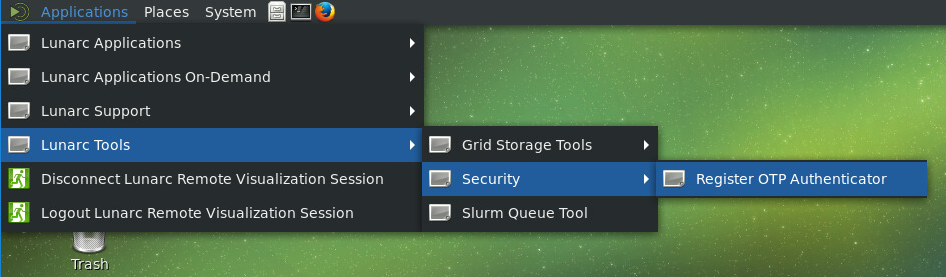

This will show the login screen to the self-service portal:

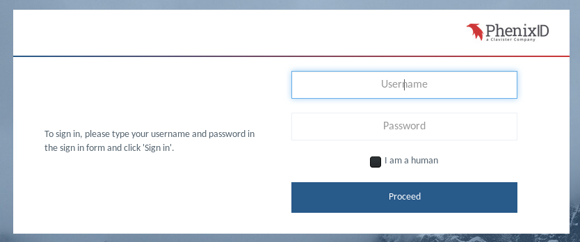

Enter your normal LUNARC credentials. Make sure to select the **I am a human** checkbox. If all is OK you will receive a SMS with a OTP token and the next screen will display:

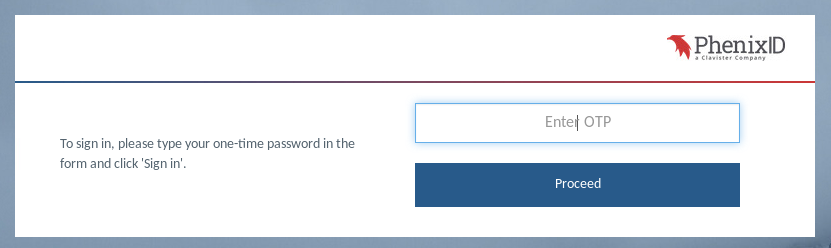

The next screen will display a GENERAL tab with user information and a TOKENS tab. Click on the TOKENS tab. This will display a button **Activate PhenixID Pocket Pass**. 

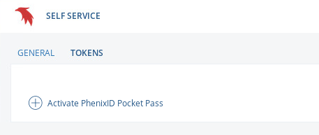

Click on the button to begin the process of adding a authenticator token. In the shown dialog enter a descriptive name for your token that will be displayed in your device.

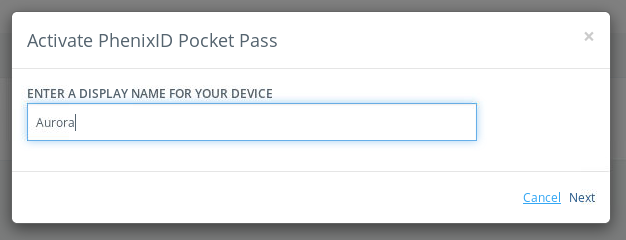

Click next to continue. This will display a QR-code, which you have to scan with the Pocket Pass app on your smartphone in the next step.  **Make sure no-one can scan your QR-code and compromise your security**

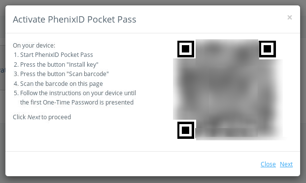

## Install the token on your smart phone
Make sure the Pocket Pass app can access the camera of your smart phone.   Open the Pocket Pass app and click **Install key**

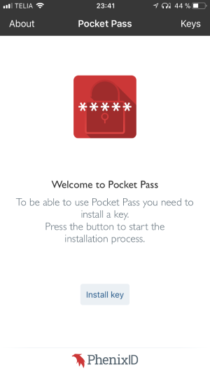

Click on the **Scan barcode**

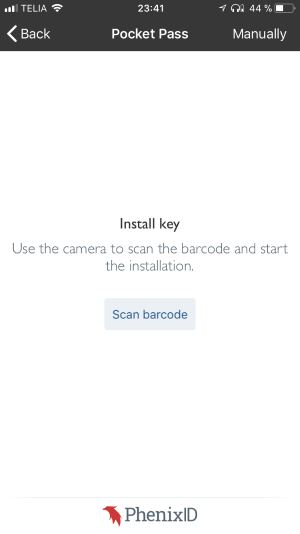

Point your camera on the QR-code shown inside the HPC desktop on your desktop/laptop computer. The app should detect the code and install the key automatically. 

In the next step the app asks you for a pin-code to protect your key. Enter your pin-code. 

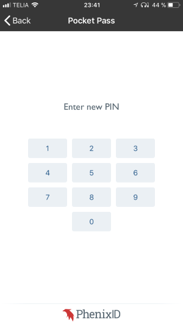

When this is done the following screen should be shown:

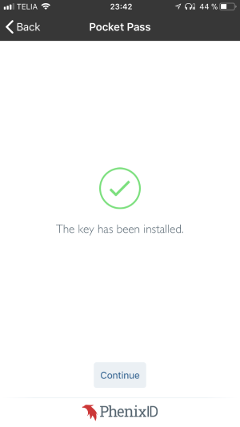

Click continue to display the current valid otp-code.

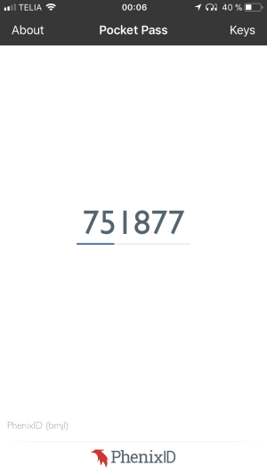

Go back to the self-service portal and click "next". You will then be prompted for an otp to finalize the activation. This OTP you will get from the pocket-pass application i.e. NOT via an text-message.

You can now login to the Lunarc systems using the Pocket Pass app. Your telephone will no longer receive SMS when connecting to a Lunarc system.
