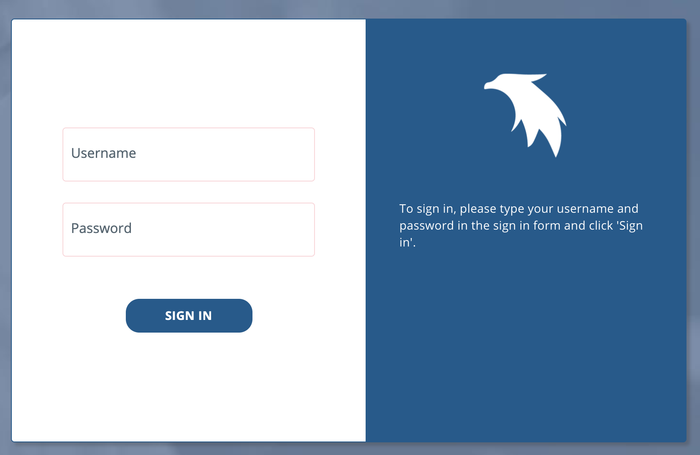
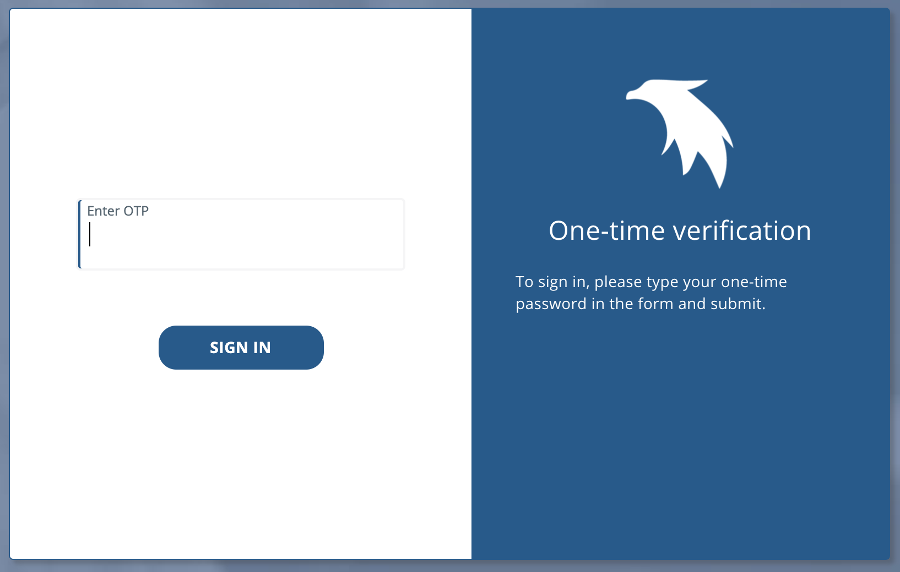
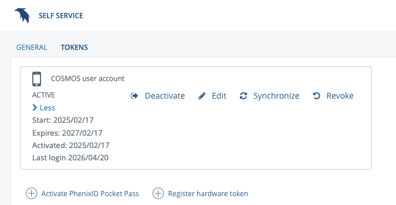

# Installing, setting up  and using the Pocket Pass authenticator

The process to install and set up the Pocket Pass authenticator is in five (5) steps, it is important that ALL steps are performed correctly so PLEASE read the instructions carefully.

## STEP 1:  Download and install Pocket Pass
Download and install the **PhenixID Pocket Pass** app on your smartphone.  The correct app is free of charge.

### Download for Apple iOS

### Download for Android OS

## STEP 2:  Accessing the self-service portal

Activation of the Pocket Pass app is done via a web-based activation portal.  Activation can be done in any web browser from any computer.  The link to the activation portal is [https://phenix3.lunarc.lu.se/selfservice/](https://phenix3.lunarc.lu.se/selfservice/). 

## STEP 3:  Token activation
The self service portal will show the following login screen:

Enter your normal LUNARC credentials. If all is OK you will receive a SMS with a OTP token to the phone number registered in our system.  The next screen will display:

The next screen will display a GENERAL tab with user information and a TOKENS tab. Click on the TOKENS tab. This will display a button **Activate PhenixID Pocket Pass**. 

Click on the button to begin the process of adding a authenticator token. In the shown dialog enter a descriptive name for your token that will be displayed in your device.

Click next to continue. This will display a QR-code, which you have to scan with the Pocket Pass app on your smartphone in the next step.  **Make sure no-one can scan your QR-code and compromise your security**

## STEP 4:  Install the token on your smart phone
Make sure the Pocket Pass app can access the camera of your smart phone.   Open the Pocket Pass app and click **Install key**

Click on the **Scan barcode**

Point your camera on the QR-code shown inside the HPC desktop on your desktop/laptop computer. The app should detect the code and install the key automatically. 

In the next step the app asks you for a pin-code to protect your key. Enter your pin-code. 

When this is done the following screen should be shown:

Click continue to display the current valid otp-code.

## STEP 5:  Important last step: Activate your token

Go back to the self-service portal and click "next". You will then be prompted for an otp to finalize the activation. You will get this otp from the pocket-pass application and will **NOT** be sent a text-message.

Your token will expire in two year's time.

## Completed

You can now login to the LUNARC systems using the Pocket Pass app. Your telephone will not receive an SMS when connecting to a Lunarc system. Having entered your password you will be prompted to enter your Pocket Pass OTP when logging in.

Your token will expire in two year's time and you will have to create a new one.

#Checking the validity of your token
You can check the validity, in particular the expiration state, of your pocket pass token inside the self-service portal.  Use

* your Aurora password (Not your SUPR password)
* the one-time-password sent by **text message** to your mobile (Not from the Pocket Pass app) 

when following [steps 2](#step-2-accessing-the-self-service-portal) and 3 mentioned above to access the self-service portal.  Please check the [Aurora FAQ](https://lunarc-documentation.readthedocs.io/en/latest/aurora_faq/#could-your-send-my-one-time-password-for-pocket-pass-activation-to-my-new-mobile-phone-number) if you need to update your mobile phone number.

Inside the self-service portal, go to the **TOKENS** tab.  You will see your tokens.  Klicking on **More** will reveal the relevant dates for your token:

If your token has expired, please go through [steps 3](#step-3-token-activation) to 5 to create a new token.  Please do not **forget step 5**.  Newly created tokens will expire after two years.
