# Activating Two-Factor Authentication (2FA)

!!! warning "Complete all five steps"
    All steps must be performed correctly or your login will fail. **Do not skip Step 5** — it is the most commonly missed step.

## Step 1: Download and install PhenixID OneTouch

Download and install the **PhenixID OneTouch** app on your smartphone. The app is free of charge.

### Apple iOS

[{: style="width:200px"}](https://apps.apple.com/se/app/phenixid-onetouch/id1118849636 "OneTouch on the App Store")

### Android

[{: style="width:200px"}](https://play.google.com/store/apps/details?id=com.phenixidentity.onetouch "OneTouch on Google Play")

## Step 2: Accessing the self-service portal

Token activation is done through a web portal — use any browser on any computer.

[Self-service portal](https://phenix3.lunarc.lu.se/selfservice/){ .md-button }

## Step 3: Token registration

The portal will show the following login screen:

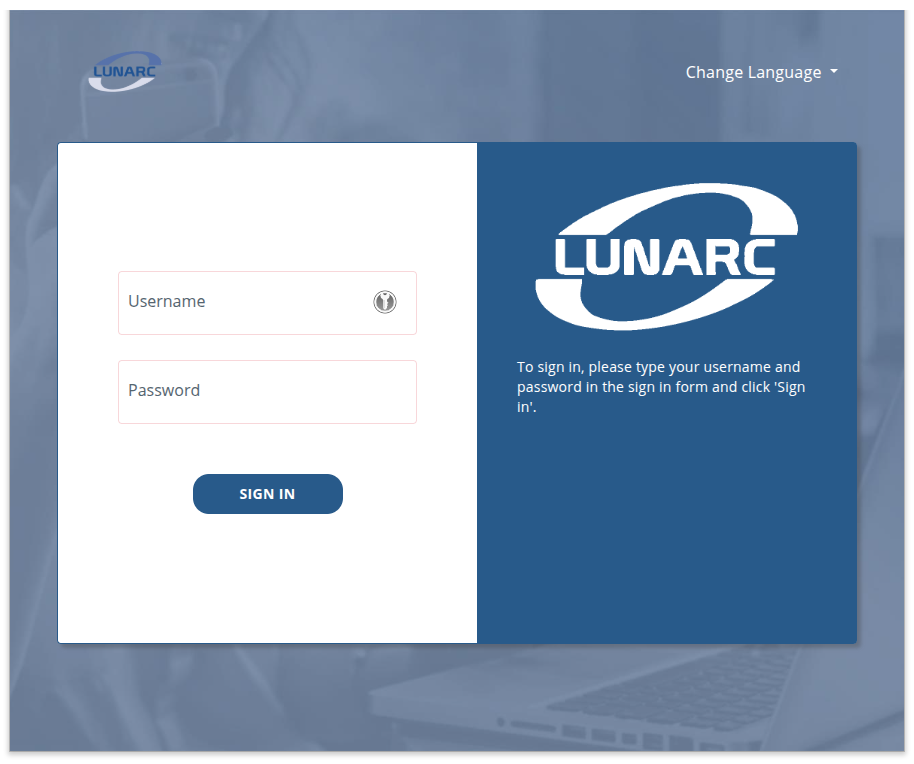

Enter your **LUNARC** username (not an email address) and your LUNARC password. These are the same credentials used to log in to COSMOS via SSH or ThinLinc, and are generally different from your LU credentials.

If the login succeeds, you will receive an SMS with an OTP to your registered phone number. Enter it on the next screen:

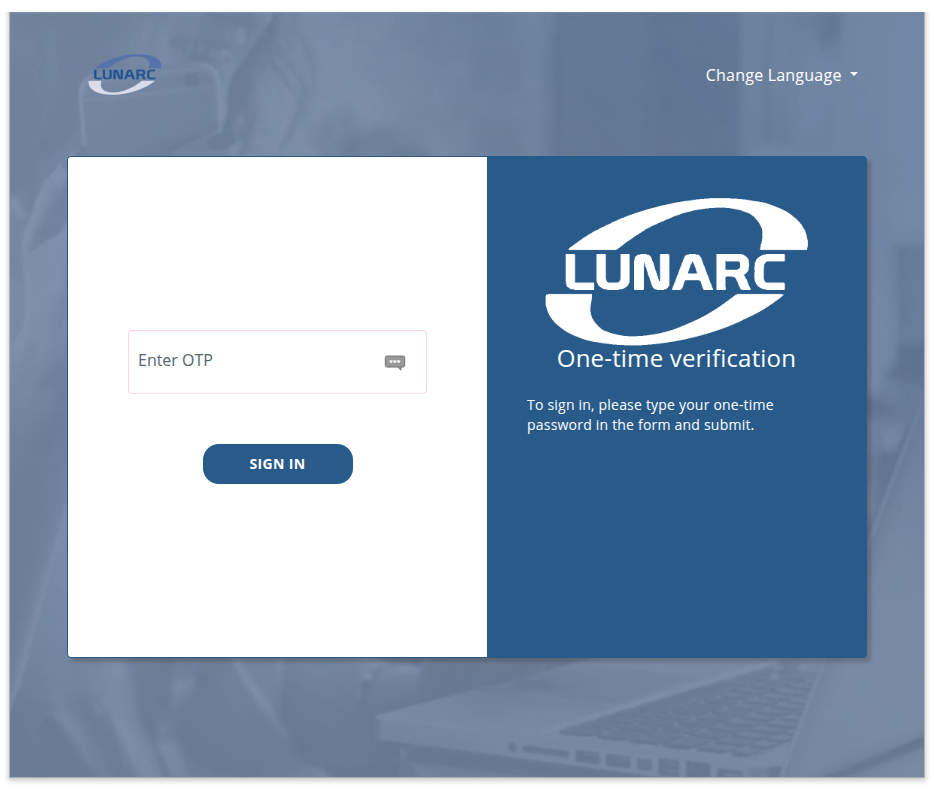

You will then see a page with a **GENERAL** tab and a **TOKENS** tab. Click the **TOKENS** tab, which shows an **Activate PhenixID Pocket Pass** button:

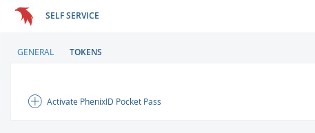

Click the button to begin token activation. Enter a descriptive name for your token — this name will appear on your device:

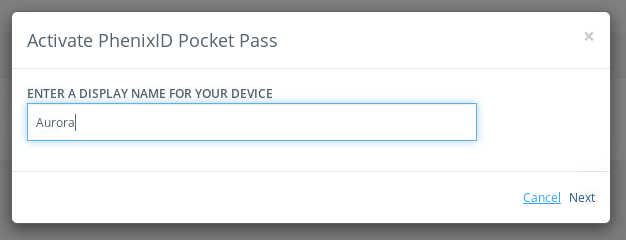

Click **Next**. A QR code will be displayed — you will scan this with the OneTouch app in the next step.

!!! warning "Keep your QR code private"
    Do not let anyone else scan your QR code. It grants full access to your two-factor authentication.

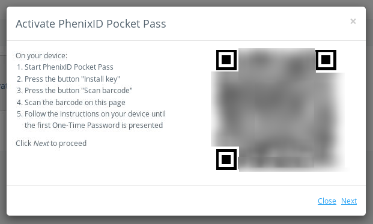

## Step 4: Install the token on your smartphone

Make sure the OneTouch app has camera access. Open the app and tap **Install key**:

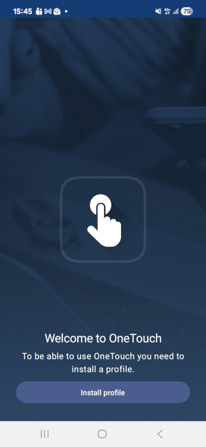

Tap **Scan barcode**:

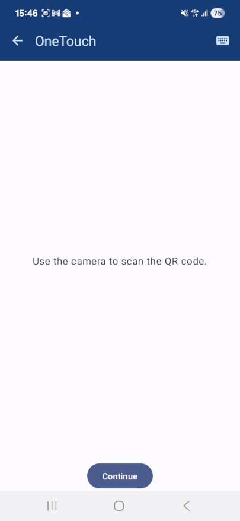

Point your camera at the QR code shown on your computer screen. The app will detect the code and install the key automatically.

The app will then ask you to set a PIN to protect your key:

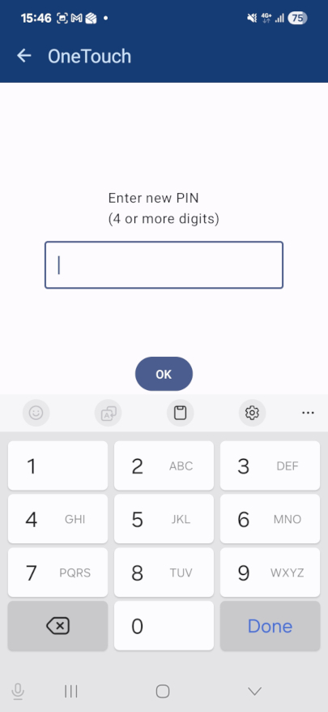

When the key is installed, you will see a confirmation screen:

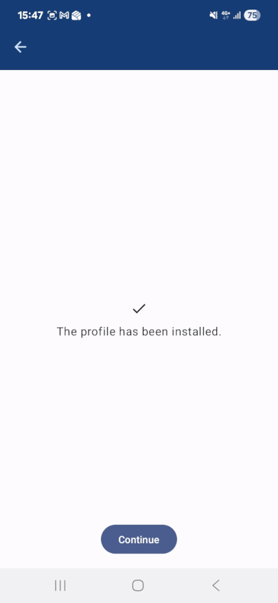

Tap **Continue**, then **One-time password** to display your current OTP. You will be asked to enter the PIN you just set:

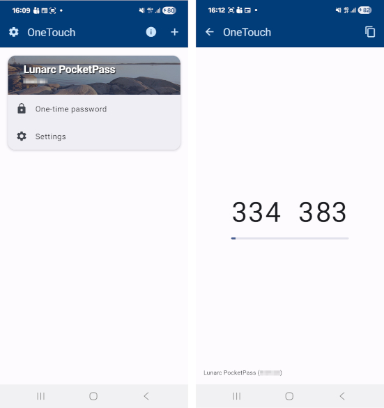

## Step 5: Activate your token

!!! danger "Do not skip this step"
    This is the step most users miss. Without it your token will not work.

Go back to the self-service portal and click **Next**. You will be prompted for an OTP to finalise the activation — use the code from the **OneTouch app** (it will **not** arrive by SMS at this point).

Your token will expire after two years, at which point you will need to register a new one.

## Setup complete

You can now log in to LUNARC systems. After entering your password you will be prompted for the OTP from the OneTouch app.

---

## Checking the validity of your token

You can check whether your token is still valid — and when it expires — through the self-service portal.

To log in to the portal for this check, use:

- Your **LUNARC password** (not your SUPR password)
- The OTP sent by **SMS** to your registered phone number (not from the OneTouch app)

Follow [Step 2](#step-2-accessing-the-self-service-portal) and [Step 3](#step-3-token-registration) above to reach the portal, then go to the **TOKENS** tab and click **More** to see the expiration dates for your token:

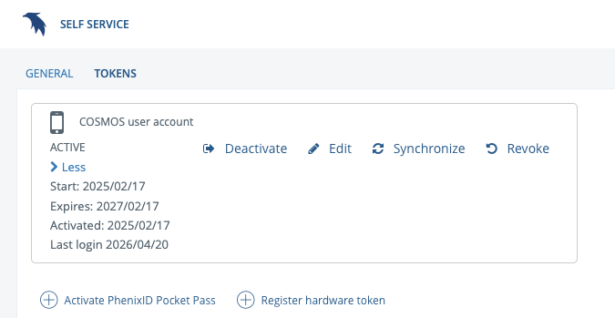

If your token has expired, repeat Steps 3–5 to create a new one.

!!! tip "Changed your phone number?"
    If your registered phone number has changed, see the [FAQ](../manual/faq/manual_faq_login.md#could-your-send-my-one-time-password-for-pocket-pass-activation-to-my-new-mobile-phone-number) for how to update it.

---

## Troubleshooting

### "Check your details to complete the login"

This vague error typically occurs when you attempt to set a password and register a Pocket Pass at the same time, causing a conflict. Start over from the beginning:

1. [Reset your password at the self-service portal](https://phenix3.lunarc.lu.se/pss)
2. Then return to [Step 2](#step-2-accessing-the-self-service-portal) of this guide to set up your token

---

**Author:**
(LUNARC)

**Last Updated:**
2025-10-04
