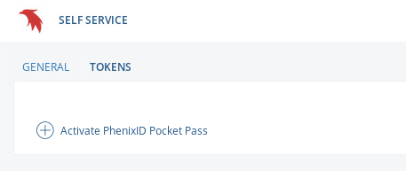
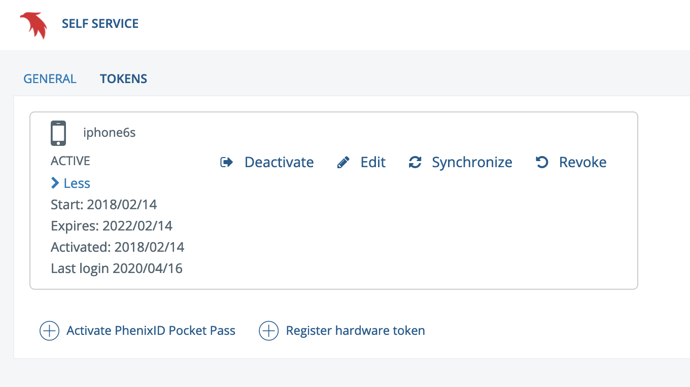

The process to install and set up the OneTouch authenticator is in five (5) steps, **ALL** steps must be performed correctly so **PLEASE** read the instructions carefully.

## Step 1: Download and install PhenixID OneTouch
Download and install the **PhenixID OneTouch** app on your smartphone. The correct app is free of charge.

### Download for Apple iOS

[{: style="width:200px"}](https://apps.apple.com/se/app/phenixid-onetouch/id1118849636 "OneTouch download")

### Download for Android OS

[{: style="width:200px"}](https://play.google.com/store/apps/details?id=com.phenixidentity.onetouch "OneTouch download")

## Step 2: Accessing the self-service portal

Activation of the OneTouch app is done via a web-based activation portal. This can be done with any web browser from any computer. Use the link below to access the portal:

[Self-service portal](https://phenix3.lunarc.lu.se/selfservice/)

## Step 3: Token activation
The self-service portal will show the following login screen:

Enter your **LUNARC** username (not an email address) and password. These will generally be different from your LU credentials; if you are an existing user returning to these instructions to reset your password or replace a PocketPass, the username and password that PhenixID needs are the same as the ones used to log into COSMOS with SSH or ThinLinc. If everything works, you will receive an SMS with an OTP token to the registered phone number. Enter the OTP token on the next page:

If everything worked you will be taken to a page with a **GENERAL**-tab with user information and a **TOKENS**-tab with the registered tokens. Click on the **TOKENS**-tab. This will display a button **Activate PhenixID Pocket Pass**. 

Click on the button to begin the process of activating a token. In the shown dialog enter a descriptive name for your token that will be displayed on your device.

Click next to continue. This will display a QR code, which you scan with the OneTouch app on your smartphone in the next step.  **Make sure no one can scan your QR code and compromise your security**

## Step 4: Install the token on your smart phone

Make sure the OneTouch app can access the camera of your smartphone. Open the OneTouch app and click **Install key**

Click on **Scan barcode**

Point your camera to the QR code shown inside the HPC desktop on your desktop/laptop computer. The app should detect the code and install the key automatically. 

In the next step, the app asks you for a pin code to protect your key. Enter your pin code. 

When this is done the following screen should be shown:

Click continue and One-time password to display the current valid OTP-code. The app will ask you to enter your own PIN code (the PIN code you entered in step 4).

## __Step 5: Important last step: Activate your token__

Go back to the self-service portal and click "next". You will then be prompted for an OTP to finalize the activation. You will get this OTP from the OneTouch application (it will **NOT** be sent as a text-message).

Your token will expire in two year's time at which time you will need to activate a new token.

## Completed

You can now log in to the LUNARC systems using the OneTouch app. Having entered your password you will be prompted to enter your OneTouch generated OTP-token when logging in.

## Checking the validity of your token

You can check the validity, in particular the expiration state, of your pocket pass token inside the self-service portal.  Use

* your LUNARC password (not your SUPR password)
* the one-time-password sent by **text message** to the phone number you have registered (not from the OneTouch app) 

when following [steps 2](#step-2-accessing-the-self-service-portal) and [3](#step-3-token-activation) mentioned above to access the self-service portal.  Please check the [FAQ](/../manual/faq/manual_faq_login/#could-your-send-my-one-time-password-for-pocket-pass-activation-to-my-new-mobile-phone-number) if you need to update your mobile phone number.

Inside the self-service portal, go to the **TOKENS** tab.  You will see your tokens.  Klicking on **More** will reveal the relevant dates for your token:

If your token has expired, please go through [steps 3](#step-3-token-activation) to 5 to create a new token.  Please do not **forget step 5**.  Newly created tokens will expire after two years.

## Troubleshooting

### Check your details to complete the login

> Check your details to complete the login

This is a vague error that can happen when you are trying to get a password
and trying to get a Pocket Pass at the same time.

Try again from the start:

- [Reset your password at the self service portal](https://phenix3.lunarc.lu.se/pss)
- Get your OneTouch authenticator set up

---

**Author:**
(LUNARC)

**Last Updated:**
2025-10-04
