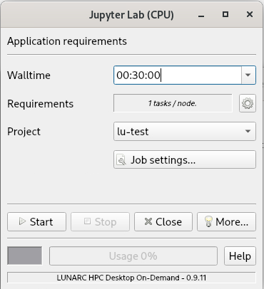
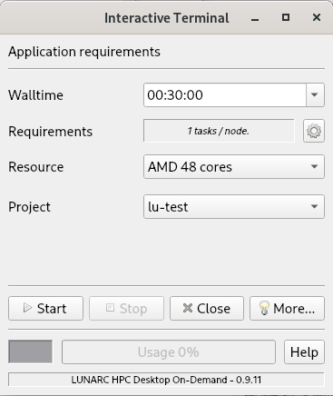
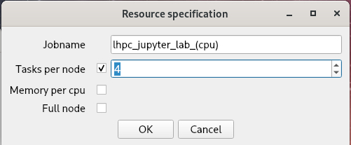

# On-demand applications

The LUNARC **Desktop on-demand** facilitates the interactive execution of resource intensive applications on LUNARC's HPC cluster COSMOS.  It utilises the graphical application launcher (GfxLauncher) for launching graphical or interactive applications through SLURM.  It is responsible for submitting a job to SLURM, connecting to the application running on the node and monitoring the progress of the application.

The **Desktop on-demand** is particularly use full for interactive work consuming small to medium resources levels (cpu time, core count, memory, etc.).  Computational work not requiring interactive supervision, utilising significant resources and/or multiple nodes is better submitted using the [batch system](../../manual/submitting_jobs/manual_basic_job).  

## Starting on-demand applications

Click on **Applications** in the top left hand corner of the [LUNARC HPC desktop](../using_hpc_desktop). You get a pull down menu, as shown below.   

Hover over a group on the left side of the menu. On the right hand side you will be shown the applications that can be started in this group. The below example shows the interface when hovering over **Applications Python**:

Groups starting with **Applications** will use the launcher to start the application on a dedicated server.  Clicking on an application on the right hand side will start the job launcher.

The remaining groups with names starting differently from **Applications**, will start applications and tools on the login-nodes.  The login-nodes are only suitable for lightweight work, consuming limited CPU time and memory.  

## Job Launcher

GfxLauncher has a very minimal user interface for the user to specify the requested time the application is needed, any specific resources required (GPU, CPU) and the project charged when running the application. Two examples for the main user interface is described in the following figures.

You can make the following selections:

| Terminal option | Description |
|-----------------|-----------------------|
| Walltime        | Specify how long you need the application.   The session will be terminated once the time has elapsed |
| Requirements    | Select number of cores utilised, memory available etc.  Use the cog wheel to change.  You will be presented with another interface to change these settings |
| Project         | GfxLauncher presents you with a list of projects you have access to.   Select the project you want the job to be charged to |
| Resource        | Select the resource type (e.g. node type) required |
| Job settings... | Allows you select a specific application if the default does not full fill your needs |

The available options depend on the application.

Hit the **Start**-button to start your session.  This will put a resource request into the job queue (SLURM) of the system and will be competing for resources on an equal level with request submitted through the [batch system](../../manual/submitting_jobs/manual_basic_job).  Depending on your request (e.g. resource level, resource type, job time) you may encounter a significant wait time before your session starts.  

## Resources
Depending on the application one or more of the following resource types can be choosen with the *Resource*-option.

| Resource | Description                 |
|----------|-----------------------------|
| AMD 48 cores | CPU node with two AMD EPYC 7413 processors (Milan).  Up to 48 cores can be requested. |
| Intel 32 cores | CPU node with two Intel Xeon Gold 6226R processors (Cascade Lake). Up to 32 cores can be requested |
| AMD/NVIDIA A40 48c 24h |   GPU node with two AMD EPYC 7413 processors (Milan) and one NVIDIA A40 GPU.  Up to 48 cores can be requested  | 
| Intel/NVIDIA A40 32c 48h | GPU node with two Intel Xeon Gold 6326 processors and one NVIDIA A40 GPU. Up to 32 cores can be requested.

Please note that for a given application not all resources are shown in the launcher dialog box.  Which resources are displayed is determined by the application.

## Resource requirements
When using the cog wheel button of the **Requirements** option in the job launcher main window you get to the resource specification window:

In this window you can set

| Terminal option | Description |
|-----------------|-------------|
| Jobname         | Specify a jobname to identify your job with e.g. squeue on a command line |
| Tasks per node  | Number of cores to be used for your job.  Make sure your application can utilise all the requested cores.  Your project will be charged for all the cores you request here |
| Memory per cpu  | Leave this unchecked if you want to use default settings.  If you check the box, you can enter the amount of memory per core you need in MB.  If you request more memory than your fair share, your project will be charged for the cores left without memory |
| Full node       | By checking the box you request all the cores and memory of the resource specified.  Your project will be charged for the full node |

At the time of writing the on-demand desktop does not support multi-node running. 

## SLURM output files

Since the the Desktop on-Demand submits your resource request to SLURM, SLURM will be writing output files.   These are located in the hidden directory `~/.lhpc`, which is in your homespace.  It might be a good idea to clean this out from time to time, to save some disc space.

---

**Author:**
(LUNARC)

**Last Updated:**
2024-08-07
