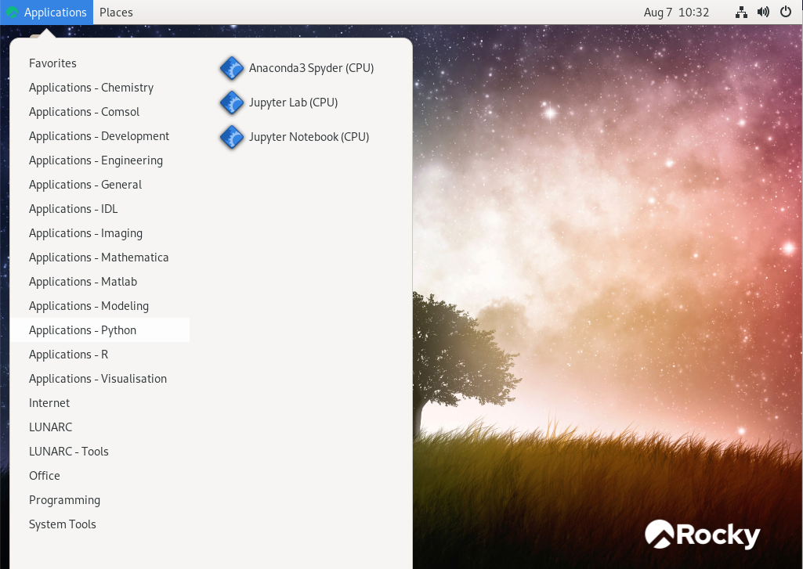
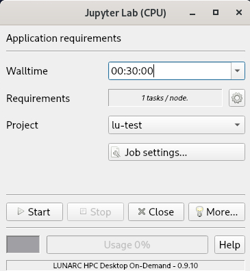

# On-demand applications

The LUNARC **On-demand desktop** facilitates the interactive execution of resource intensive applications on LUNARC's HPC cluster COSMOS.  It utilises the graphical application launcher (GfxLauncher) for launching graphical or interactive applications through SLURM.  It is responsible for submitting a job to SLURM, connecting to the application running on the node and monitoring the progress of the application.

## Starting on-demand applications

Click on **Applications** in the top left hand corner of the [LUNARC HPC desktop](../using_hpc_desktop). You get a pull down menu, as shown below.   

Hover over a group on the left side of the menu. On the right hand side you will be shown the applications that can be started in this group. The below example shows the interface when hovering over **Applications Pyton**:

Groups starting with **Applications** will use the launcher to start the application on a dedicated server.  Clicking on an application on the right hand side will start the job launcher.

## Job Launcher

GfxLauncher has a very minimal user interface for the user to specify the requested time the application is needed, any specific resources required (GPU, CPU) and the project charged when running the application. The main user interface is described in the following figure:

* Walltime: Specify how long you need the application.   The session will be terminated once the time has elapsed
* Requirements: Select number of cores utilised, memory available etc.  Use the cog wheel to change.  You will be presented with another interface to change these settings.
* Project: GfxLauncher presents you with a list of projects you have access to.   Select the project you want the job to be charged to.
* Job setting ...: Allows you select a specific application if the default does not full fill your needs.

## Resources

| Resource | Description |
|--------|-----------------------------|
| On-demand | Servers providing support for hardware accelerated applications (OpenGL). |
| On-demand (A40) | Servers for hardware accelerated applications using NVIDIA A40 GPU. |
| COSMOS CPU | Standard COSMOS CPU server. |
| COSMOS GPU (A40) | COSMOS GPU server with NVIDIA A40. | 
| COSMOS GPU (A100) | COSMOS GPU server with NVIDIA A100. | 
| Windows on-demand (V100) | Windows server providing hardware accelerated windows sessions. |

<!--| Aurora CPU | Standard Aurora CPU server. |
| Aurora CPU (32c) | Upgraded Aurora CPU servers with 32 cores / server. |
| Aurora GPU (K80) | Standard Aurora GPU server with NVIDIA K80. |
| Aurora GPU (A100) | Upgraded Aurora GPU server with NVIDIA A100. | -->

Please note that for a given application not all resources are shown in the launcher dialog box.  Which resources are displayed is determined by the application.
The remaining groups with names starting differently from **Applications**, will start applications and tools on the login-nodes.  The login-nodes are only suitable for lightweight work, consuming limited CPU time and memory.  

---

**Author:**
(LUNARC)

**Last Updated:**
2024-08-07
