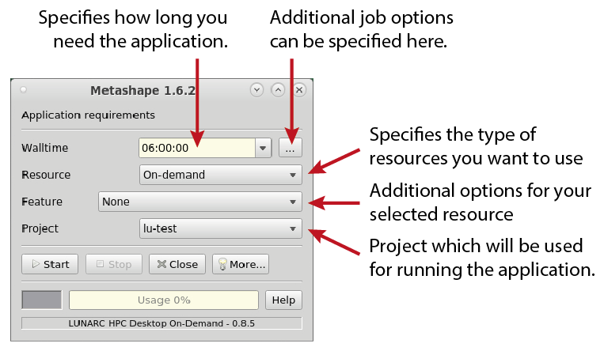
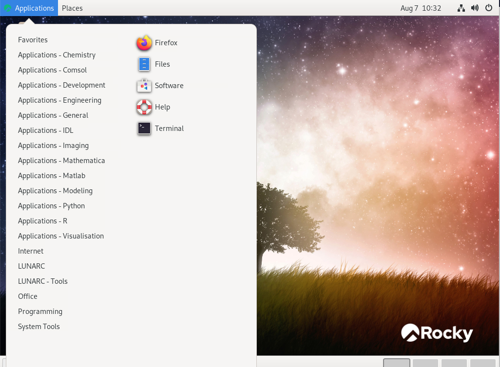

# On-demand applications

The graphical application launcher (GfxLauncher) is a software for launching graphical or interactive applications through SLURM. It is responsible for submitting a job to SLURM, connecting to the application running on the node and monitoring the progress of the application.

## User interface

GfxLauncher has a very minimal user interface for the user to specify the requested time the application is needed, any specific resources required (GPU, CPU) and the project charged when running the application. The main user interface is described in the following figure:

## Resources

| Resource | Description |
|--------|-----------------------------|
| On-demand | Servers providing support for hardware accelerated applications (OpenGL). |
| On-demand (A40) | Servers for hardware accelerated applications using NVIDIA A40 GPU. |
| COSMOS CPU | Standard COSMOS CPU server. |
| COSMOS GPU (A40) | COSMOS GPU server with NVIDIA A40. | 
| COSMOS GPU (A100) | COSMOS GPU server with NVIDIA A100. | 
| Windows on-demand (V100) | Windows server providing hardware accelerated windows sessions. |

<!--| Aurora CPU | Standard Aurora CPU server. |
| Aurora CPU (32c) | Upgraded Aurora CPU servers with 32 cores / server. |
| Aurora GPU (K80) | Standard Aurora GPU server with NVIDIA K80. |
| Aurora GPU (A100) | Upgraded Aurora GPU server with NVIDIA A100. | -->

Please note that not all resources are shown in the launcher dialog box. Which resources are displayed are determined by the application.

## Starting on-demand applications

Click on **Applications** in the top left hand corner of the [LUNARC HPC desktop](../using_hpc_desktop) and you get a pull down menu, as shown below.   Hower over the groups on the left side of the menu. On the right hand side you will be shown the applications that can be started whithin this group. Groups starting with **Applications** will use the launcher to start the application on a dedicated server. 

 

The remaining groups will start applications and tools on the login-nodes.  The login-nodes are only suitable for lightweight work, consuming limited CPU time and memory.  

---

**Author:**
(LUNARC)

**Last Updated:**
2024-03-07
