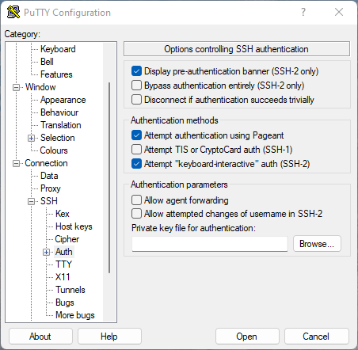

# How to login

There are two main ways of accessing the LUNARC systems:

 * The LUNARC HPC desktop, described in a separate [guide](using_hpc_desktop.md)
 * Terminal and command-line tools

???- question "Prefer a video?"

    See [the YouTube video 'Login to LUNARC's COSMOS using SSH, including password and Pocket Pass reset'](https://youtu.be/sMsenzWERTg)

This document describes the second item: how to access our system using a terminal and command-line tools. To get access to a terminal the user has to login in to LUNARC using a Secure Shell (SSH) terminal client, for example:

```console
ssh cosmos.lunarc.lu.se -l username
```

or

```console
ssh username@cosmos.lunarc.lu.se
```

On Linux and macOS this client is built-in to the system and no installation is necessary. Windows do not have a standard SSH terminal so an external application is needed such as [PuTTY](http://www.chiark.greenend.org.uk/~sgtatham/putty/download.html) is needed. However, windows users are recommended to use the [HPC desktop](using_hpc_desktop.md)

To authenticate to the LUNARC system a two-factor authentication solution is used. Two-factor authentication uses two factors for authentication instead of just one, e.g. a username and password. In the LUNARC case the two factors are:

1. Username and password.
2. One-time password generated by the [Pocket Pass app](authenticator_howto.md) on your smartphone.

When you apply for an account your mobile number is registered in our user database.  This will be used when first connecting to our system.  Users have to switch to the [Pocket Pass app](authenticator_howto.md) before they can access the systems.

The login process is described in the following sections.

## First login and server fingerprints

If you have yet to log into any LUNARC systems, SSH or the Thinlinc clients will prompt you to verify the server fingerprint. The reason for this is to make sure that you login to the correct server. Below are the fingerprints of the LUNARC front-end servers:

```console
2048 SHA256:NQ/G3C89HTTHDsNo53MueduO8s9WA4ePCCn4XV1G5do cosmos.lunarc.lu.se (RSA)
256 SHA256:Dz3UFUfoEItFI6Oee1NRmpx+r4mkD1PLnm6NKrl6a6s cosmos.lunarc.lu.se (ECDSA)
256 SHA256:cmCshUQAZ+DqFRyMntx9NbNHSDu9BExg8OJ+TX05gCs cosmos.lunarc.lu.se (ED25519)
```

## Logging in using One Time Passwords (OTP)

Logging in to the LUNARC system with OTP passwords is not very different from a normal SSH login, except for the additional extra password prompt. A typical session is shown in the following example:

    login as: joeuser
    Password:
    Please enter your onetime password: 123456

If the OTP and password are correct you will be logged in to the system.

## Linux

To be prompted for the OTP password the ssh client must be configured for keyboard-interactive login. These settings can be modified in either **/etc/ssh/ssh_config** (Redhat systems) or in the home-directory **~/.ssh/config**. An example configuration is shown below:

```ssh-config
Host cosmos.lunarc.lu.se
  PreferredAuthentications keyboard-interactive

Host *
  PreferredAuthentications hostbased,publickey,keyboard-interactive,password
```

In the above example, COSMOS is configured for keyboard-interactive login, but all other hosts are configured with default login options.

To reduce the number of logins to the system the **ServerAlive** option can also be added:

```ssh-config
Host cosmos.lunarc.lu.se
  PreferredAuthentications keyboard-interactive
  ServerAliveInterval 10

Host *
  PreferredAuthentications hostbased,publickey,keyboard-interactive,password
```

## macOS

macOS is already configured to handle the login to LUNARC resources with one time passwords (keyboard-interactive).

To reduce the number of logins to the system the **ServerAlive** option can also be added:

```ssh-config
Host cosmos.lunarc.lu.se
  PreferredAuthentications keyboard-interactive
  ServerAliveInterval 10

Host *
  PreferredAuthentications hostbased,publickey,keyboard-interactive,password
```

## Windows

To be prompted for the OTP password the PuTTY client must be configured for keyboard-interactive login. Open PuTTY from the start menu. Load the session options for your selected resource. Open the **Connection/SSH/Auth** item in the tree view. Make sure the "Attempt "keyboard-interactive" auth (SSH-2) is checked in the settings, see the following image:

To reduce the number of logins to the system the "Seconds between keepalives" can be changed to a value greater than 0. See the following figure:



---

## Troubleshooting

### SSH keeps asking for a password

Assuming you have a LUNARC account, this happens because the Pocket Pass has not been activated yet. Activate your Pocket Pass and try again.

**Author:**
(LUNARC)

**Last Updated:**
2024-08-08
