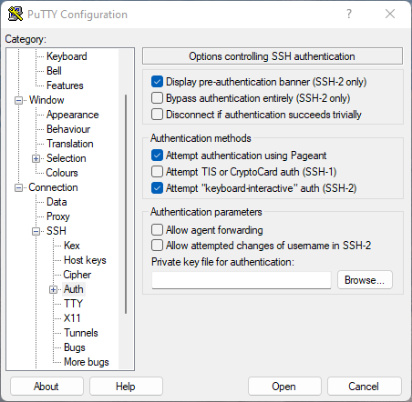

# How to log in

There are two ways to access LUNARC systems:

- The **LUNARC HPC Desktop** (ThinLinc) — see the [HPC Desktop guide](using_hpc_desktop.md)
- **SSH terminal** — described on this page

???- question "Prefer a video?"

    [Login to LUNARC's COSMOS using SSH, including password and Pocket Pass reset](https://youtu.be/sMsenzWERTg) (YouTube)

## SSH login

Connect to COSMOS using either form:

```bash
ssh cosmos.lunarc.lu.se -l username
```

```bash
ssh username@cosmos.lunarc.lu.se
```

!!! note "Server names"
    | Method | Server |
    |---|---|
    | SSH | `cosmos.lunarc.lu.se` |
    | ThinLinc (HPC Desktop) | `cosmos-dt.lunarc.lu.se` |

SSH is built into Linux and macOS. On Windows, use [PuTTY](http://www.chiark.greenend.org.uk/~sgtatham/putty/download.html) — though Windows users are generally recommended to use the [HPC Desktop](using_hpc_desktop.md) instead.

## Two-factor authentication

LUNARC uses two-factor authentication (2FA). Each login requires:

1. Your LUNARC username and password
2. A one-time password (OTP) from the [PhenixID OneTouch app](authenticator_howto.md) on your smartphone

!!! info "First-time users"
    Before you can use the Pocket Pass app, you need to activate it. Follow the [2FA setup guide](authenticator_howto.md) before attempting to log in.

## First login — server fingerprints

The first time you connect, your SSH client will ask you to verify the server fingerprint. Check it against the values below before accepting:

```text
2048 SHA256:NQ/G3C89HTTHDsNo53MueduO8s9WA4ePCCn4XV1G5do cosmos.lunarc.lu.se (RSA)
256  SHA256:Dz3UFUfoEItFI6Oee1NRmpx+r4mkD1PLnm6NKrl6a6s cosmos.lunarc.lu.se (ECDSA)
256  SHA256:cmCshUQAZ+DqFRyMntx9NbNHSDu9BExg8OJ+TX05gCs cosmos.lunarc.lu.se (ED25519)
```

## Login sequence

A typical SSH session looks like this:

```text
login as: joeuser
Password:
Please enter your onetime password: 123456
```

Enter your password first, then the OTP from your OneTouch app when prompted.

## OS-specific SSH configuration

=== "Linux"

    Your SSH client must be configured for keyboard-interactive login to receive the OTP prompt. Edit either `/etc/ssh/ssh_config` (system-wide, Redhat-based systems) or `~/.ssh/config` (per-user):

    ```text
    Host cosmos.lunarc.lu.se
      PreferredAuthentications keyboard-interactive
      ServerAliveInterval 10

    Host *
      PreferredAuthentications hostbased,publickey,keyboard-interactive,password
    ```

    `ServerAliveInterval 10` sends a keepalive every 10 seconds to prevent the connection from dropping during idle periods.

=== "macOS"

    macOS handles keyboard-interactive login automatically — no extra configuration is needed for the OTP prompt.

    To prevent the connection dropping during idle periods, add a `ServerAliveInterval` to `~/.ssh/config`:

    ```text
    Host cosmos.lunarc.lu.se
      ServerAliveInterval 10
    ```

=== "Windows (PuTTY)"

    PuTTY must be configured for keyboard-interactive login:

    1. Open PuTTY and load the session for COSMOS
    2. Navigate to **Connection → SSH → Auth** in the left-hand tree
    3. Enable **Attempt "keyboard-interactive" auth (SSH-2)**

    To prevent the session from dropping during idle periods, set **Seconds between keepalives** to a value greater than 0 under **Connection**.

    

---

## Troubleshooting

### SSH keeps asking for a password and never prompts for an OTP

Your Pocket Pass has not been activated. Follow the [2FA setup guide](authenticator_howto.md) to activate it, then try again.

### ThinLinc fails with "The SSH connection succeeded, but the ThinLinc server connection failed"

You are most likely using the wrong server name. ThinLinc requires `cosmos-dt.lunarc.lu.se`, not `cosmos.lunarc.lu.se`. See the [server names table](#ssh-login) above.

---

**Author:**
(LUNARC)

**Last Updated:**
2024-08-08
