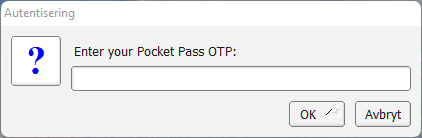

The LUNARC HPC Desktop provides LUNARC users with a solution for accelerated remote visualization that will provide a new scalable approach to HPC and scientific data visualization. The desktop introduces a convenient way to work with our clusters using not only multiple terminal windows but also file browsers, editors, graphical tools such as queue status and debuggers, 2D and 3D applications, etc.

???- question "Prefer a video?"

    See [the YouTube video 'Accessing the LUNARC HPC Desktop'](https://youtu.be/wn7TgElj_Ng).

The same 2-factor authentication as for a normal ssh session is used and the desktop session can easily be disconnected for later reconnect. The whole desktop state (including the latest mouse position) is saved and the system works both from the campus network and from home or when traveling.

The 2D desktop (currently Mate) runs on a scalable desktop infrastructure that supports multiple desktop agents and load-balancing features to ensure a smooth experience. 3D OpenGL applications are executed on dedicated visualization nodes with hardware accelerated graphics and seamlessly displayed on the 2D desktop.

## Installing and starting the HPC desktop

 1. [Download](https://www.cendio.com/thinlinc/download "Download") the Thinlinc client for either Windows, Mac or Linux 
 1. Install it on your workstation or laptop (see [install and update client](https://www.cendio.com/resources/docs/tag/client_linux.html) and select your operating system under Client Platforms)
 1. Launch the client
 1. Enter **cosmos-dt.lunarc.lu.se** in the server field 
 
    
 
 1. Enter your login credentials (Username, Password) and click [**Connect**]
 1. Enter the one time password from the [Pocket Pass app](authenticator_howto.md) on your smartphone
 
    
 
 1. Done!

    

## First login and server fingerprints

If you have yet to log into any LUNARC systems, SSH or the Thinlinc clients will prompt you to verify the server fingerprint. The reason for this is to make sure that you login to the correct server. Below are the fingerprints of the LUNARC front-end servers:

```console
2048 SHA256:NQ/G3C89HTTHDsNo53MueduO8s9WA4ePCCn4XV1G5do cosmos.lunarc.lu.se (RSA)
256 SHA256:Dz3UFUfoEItFI6Oee1NRmpx+r4mkD1PLnm6NKrl6a6s cosmos.lunarc.lu.se (ECDSA)
256 SHA256:cmCshUQAZ+DqFRyMntx9NbNHSDu9BExg8OJ+TX05gCs cosmos.lunarc.lu.se (ED25519)
```

## Resizing the desktop window and full-screen mode

There are two ways to avoid the desktop window occupying the entire screen. 

 1. Before connecting to our system (step 4 of the above list), click on *Options* or *Inställningar* (depending on whether you got an English or Swedish interface).  In the menu system that appears you can deactivate full screen and select a window size.  
 2. While being connected to our system, pressing **F8** on the keyboard (on Mac it is: **fn F8**) will bring up a menu where you, among other things, can toggle full-screen mode on or off. 

Depending on your system it might be convenient to *not _run_ in full-screen mode. Play around and see what suits you best.

## Accessing the LUNARC HPC Desktop from a web browser

It is possible to access the LUNARC HPC Desktop using a modern HTML5-enabled browser. To use this method to connect go to the following URL:

[Lunarc support](https://cosmos-dt.lunarc.lu.se:300)

A web based login screen appears. Login using your user name, password and OTP-token from your app.

## Resolving issues when connecting

After encountering issues in a desktop session (e.g. crashed application) the desktop state saved from a previous session can become corrupt. If this happens to you, you may not be able to reconnect. In this case, it is often required to start a fresh session and discard the old session.  This is achieved by checking the box: **End existing session** or **Avsluta aktiv session**, depending on the language settings of your client, on the login window before connecting to LUNARC services.


Please try before contacting [Lunarc support](https://supr.naiss.se/support/?centre_resource=c5 "LUNARC support form")

---

**Author:**
(LUNARC)

**Last Updated:**
2024-11-14
