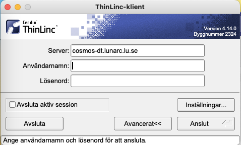

The LUNARC HPC Desktop provides LUNARC users with a solution for accelerated remote visualization that will provide a new scalable approach to HPC and scientific data visualization. The desktop introduces a convenient way to work with our clusters using not only multiple terminal windows but also file browsers, editors, graphical tools such as queue status and debuggers, 2D and 3D applications, etc.

The same 2-factor authentication as for a normal ssh session is used and the desktop session can easily be disconnected for later reconnect. The whole desktop state (including the latest mouse position) is saved and the system works both from the campus network and from home or when traveling.

The 2D desktop (currently Mate) runs on a scalable desktop infrastructure that supports multiple desktop agents and load-balancing features to ensure a smooth experience. 3D OpenGL applications are executed on dedicated visualization nodes with hardware accelerated graphics and seamlessly displayed on the 2D desktop.

## Installing and starting the HPC desktop

 1. [Download](https://www.cendio.com/thinlinc/download "Download") the client for either Windows, Mac or Linux 
 1. Install it on your workstation or laptop
 1. Launch the client
 1. Enter **aurora.lunarc.lu.se** in the server field 
 
    
 
 1. Enter your login credentials (Username, Password) and click [**Connect**]
 1. Enter the one time password from the [Pocket Pass app]((http://lunarc-documentation.readthedocs.io/en/latest/authenticator_howto/)) on your smartphone
 
    
 
 1. Done!

    

## Resizing the desktop window and full-screen mode

There are two ways to avoid the desktop window occupying the entire screen. 

 1. Before connecting to our system (step 4 of the above list), click on *Options* or *Inställningar* (depending on whether you got an English or Swedish interface).  In the menu system that appears you can deactivate full screen and select a window size.  
 2. While being connected to our system, pressing **F8** on the keyboard (on Mac it is: **fn F8**) will bring up a menu where you, among other things, can toggle full-screen mode on or off. 

Depending on your system it might be convenient to *not _run_ in full-screen mode. Play around and see what suits you best.

## Resolving issues when connecting

After encountering issues in a desktop session (e.g. crashed application) the desktop state saved from a previous session can become corrupt. If this happens to you, you may not be able to reconnect. In this case, it is often required to start a fresh session and discard the old session.  This is achieved by selecting the box: **End existing session** on the login window before connecting to LUNARC services.

Please try before contacting [Lunarc support](http://www.lunarc.lu.se/support/support_form "LUNARC support form")

## Starting the client on a Mac

Mac OSX 10.9 (Mavericks) and later: You need to

 1. Locate the client in Finder.
 2. Hold the **ctrl**-key while clicking on it.
 3. Choose the "open" option from the menu.

when opening the client for the first time to get past the "unidentified developer" notification.

---

**Author:**
(LUNARC)

**Last Updated:**
2022-10-05