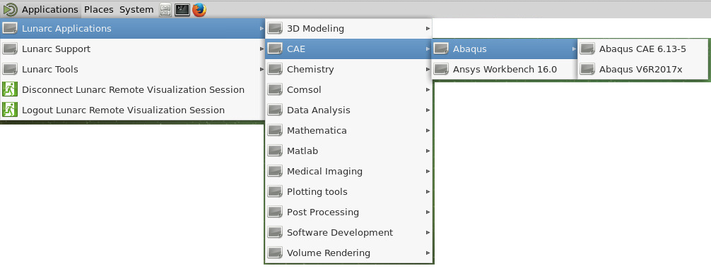

# Abaqus FEA

Abaqus is installed on the cluster. 
Using Abaqus is divided into separate tasks. 
   
To create models, set up simulation jobs and view results Abaqus CAE is used. This is started trough the menue on the LUNARC HPC Desktop as shown below.

 

To run the simulation as defined in the .inp file produced by the Abaqus CAE, a sbatch script detailing the resources needed for the simulation is required. The sbatch script is the description telling the queueing system which project is to be used, what resources are needed and for how long and also what program is to be run. The queueing system used at LUNARC is SLURM and a good tutorial on how to use it is found here: [SLURM tutorial](../../../manual/manual_intro/)

Below an example SBATCH-script to run an Abaqus-job called sample.inp is shown, adjust as needed.

```bash
#!/bin/bash
#
# job time, change for what your job requires In this example 1h (max is 170h)
#SBATCH -t 1:00:00
#
# Number of nodes used. for most Abaqus jobs one node is sufficient
#SBATCH -N 1
#SBATCH --exclusive
#
# How many cores do you need to use? Remember that a large number here WILL consume 
# a lot of tokens i.e. limit the number left for other abaqus users: Max per node is 20
#SBATCH --tasks-per-node=10
# 
# What is the name of your project i.e. snic20xy-z-n or lu20xy-z-n
#SBATCH -A <your-project-name>
# 
# A job name making it easy for you to remember what job this is
#SBATCH -J <whatever_name_you_want>
#
# For information on how the job went error etc, include %j to get uniqe identifier
#SBATCH -o process_%j.out
#SBATCH -e process_%j.err
#
# Its nice to get an email when the job has started (i.e. finished queueing) and is finished
#SBATCH --mail-user=you@your_place.se
#SBATCH --mail-type=START,END

# write this script to stdout-file - useful for scripting errors
cat $0

# copy the input data and program to node local disk
# customise for your input file(s) and program name
cp -p sample.inp $SNIC_TMP

# change to the execution directory
cd $SNIC_TMP

# Add modules, please check which module you want to use, in this example we use v6R2017x
# Please note that this MUST correspond to the version used to create the .inp file
module add abaqus/V6R2017x

# run the program 
# customise for your program name and add arguments if required
# The number of cpus MUST be equal or lower than the number of nodes times the number of 
# tasks-per-node in this case 10. 
# The memory is depending on the size of the node and if you are the only one on it 
# i.e. if you have set -N 1 or  --exclusive see the SLURM tutorial for info. 
# The scratch space should be set to . otherwise the execution will be slow and might crash. 
# interactive is a required statement otherwise the simulation will NOT run 

abaqus job=sample memory=60000MB cpus=10 scratch=. interactive

# When the run is finished, copy all the data from the execution directory to the directory 
# you started the run from.
cp -p *.* $SLURM_SUBMIT_DIR
```


In your SBATCH-script you adjust the parts unique for your job using a text-editor and save it in the directory where your .inp file is. then in the terminal, send the job desription (the SBATCH-script) to the queue using the following command:

```bash
sbatch my_SBATCH_script.sub
```

This sends the job to the queue and the job manager will start the simulation when a slot on the cluster fitting the description in the script is available.

## Running multiple Abaqus jobs in a farm

This script assumes that you have all of your .inp files in a separate directory called *jobs*. It will start one subtask per .inp file. Be aware that running multiple abaqus jobs at once require a lot of license tokens.

You will need two scripts (run.sh and work.sh). One master script detailing how many nodes/cores you want to use, the walltime, project name, and such. The slave script will set up each individual run and start abaqus on the .inp file at hand. 
The script **run.sh** is your normal SBATCH script which is started by issuing *sbatch run.sh*
The script **work.sh** is a normal bash script so it MUST be set as executable by issuing chmod +x work.sh

### run.sh

```bash
#!/bin/sh
# requesting the number of nodes needed
#SBATCH -N 1
#SBATCH -n 20
#SBATCH -A lu2018-2-10
#SBATCH -p lu
# job time, change for what your job farm requires
#SBATCH -t 50:00:00
#
# job name and output file names
#SBATCH -J jobFarm
#SBATCH -o res_jobFarm_%j.out
#SBATCH -e res_jobFarm_%j.out
cat $0

# Loop over the number of files

for filename in $(find jobs/*.inp | awk -F "/" '{print      $2}' 2> /dev/null); do
        srun -Q --exclusive -n 1 -N 1 --cpus-per-task=4 work.sh $filename &> worker_${SLURM_JOB_ID}_${filename} &
    sleep 1
done

# keep the wait statement, it is important!

wait
```

### work.sh

```bash
#!/bin/sh
# document this script to stdout (assumes redirection from caller)
echo $0
# The next line is good for debugging so you know which file is processed.
echo $1

# receive my worker number
export WRK_NB=$1

# create worker-private subdirectory in $SNIC_TMP
export WRK_DIR=$SNIC_TMP/WRK_${WRK_NB}
mkdir $WRK_DIR

# create a variable to address the "job directory"
export JOB_DIR=${SLURM_SUBMIT_DIR}/jobs

# now copy the input data and program from there
cd $JOB_DIR

#This copies the file in the loop to the worker dir.
cp -p $WRK_NB $WRK_DIR

# change to the execution directory
cd $WRK_DIR


# run the program, 
# Be sure to add the module for your version of abaqus. 
# The memory should be the product of cpu and 3000MB
module add abaqus/V6R2017x
abaqus job=${WRK_NB} memory=12000MB cpus=4 scratch=. interactive


# rescue the results back to job directory
cp -p *.odb ${JOB_DIR}

# clean up the local disk and remove the worker-private directory

cd $SNIC_TMP
rm -rf WRK_${WRK_NB}
```

---

**Author:**
(LUNARC)

**Last Updated:**
2022-10-05