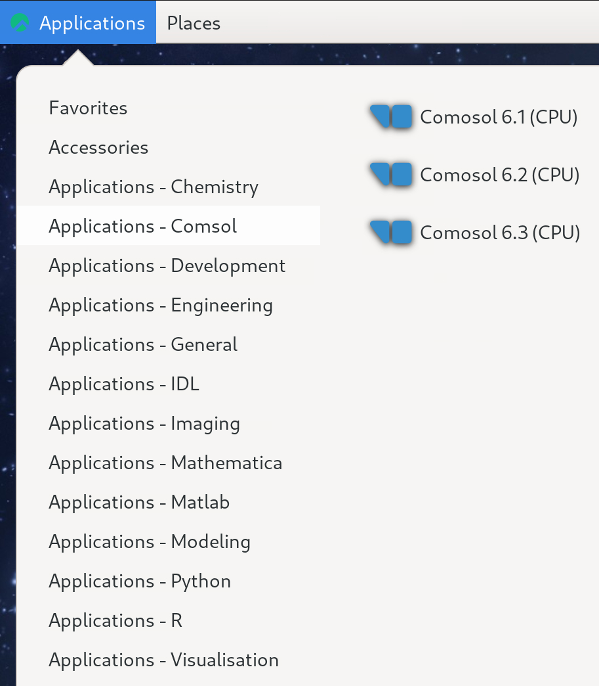
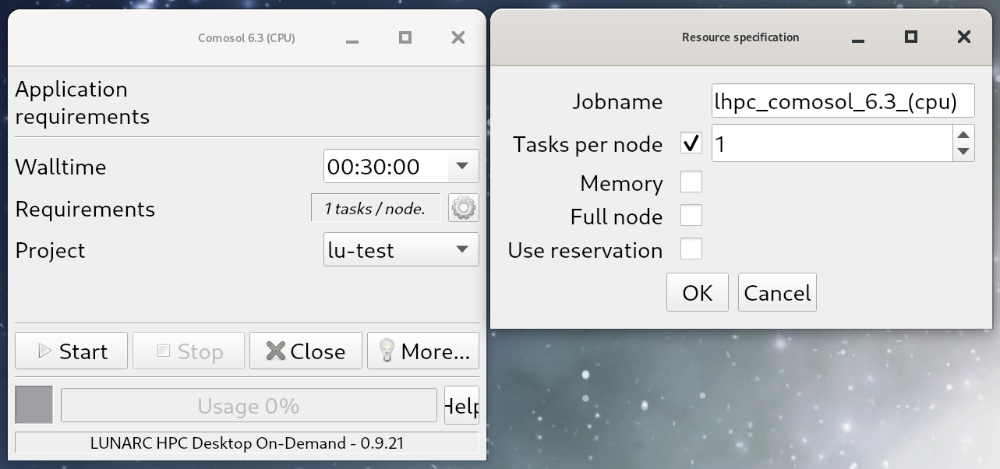

# COMSOL

COMSOL is installed on the cluster. It can either be used non-interactively for running a `.mph` file by sending it through the queue system from any login node, or interactively from the LUNARC desktop.

## Non-interactive use

Given a `.mph` file, COMSOL can be started and run on a compute node using a batch script. An example script is given below:

```bash
#!/bin/bash
#
# job time, change for what your job requires In this example 1h 
#SBATCH -t 1:00:00
#SBATCH -N 1
#SBATCH --ntasks-per-node=20
#
#SBATCH -A <your-project-name>
# job name
#SBATCH -J <your_job_name>
#
# filenames stdout and stderr - customise, include %j
#SBATCH -o process_%j.out
#SBATCH -e process_%j.err
#
# write this script to stdout-file - useful for scripting errors
cat $0

# Add modules (specify version for reproducibility)
module load comsol/<version>

# run the program 
# customise for your program name and add arguments if required

comsol batch -inputfile  input.mph -outputfile output.mph 
```

This will run the job input.mph on the cluster and save the output to output.mph

## Interactive use

To run interactively, the LUNARC Desktop (ThinLinc) MUST be used. Running COMSOL interactively works similarly to other On-Demand applications.

At the top left of the HPC Desktop, click `Applications`, then hover over `Applications - Comsol`, and select your desired version of COMSOL from the menu that pops up to the side of the main menu, as shown below:

 

Once you have clicked a version of COMSOL to run, a popup---the GfxLauncher window---will appear that says "Application Requirements" just under the title bar. Below that will be several drop-down menus: 

- "Walltime",
- "Requirements", and
- "Project".

These will have some default values filled in, but all of them can be changed as needed. For Walltime in particular, if you do not like the provided options, you can type in any value for the number of hours, minutes, and seconds up to `168:00:00`, but it is strongly recommended that you choose the shortest time that you think you can work within to reduce the amount of time spent in the queue waiting for your session to start.

If you want a different number of tasks per node (i.e. if you need more cores and/or want to change the default memory per core), click the gear icon (:gear:) to the right of the Requirements line item. A second popup will appear with options to name your job, vary the number of tasks per node, change the memory per core (be careful with this option!), occupy a full node, or use a reservation.

 
> Left: main GfxLauncher window showing the default application requirements for COMSOL. Right: Popup that appears after clicking the :gear: icon and enables custom resource specifications.

Once you are happy with your settings, click Start at the bottom. The grey box to the left of the Usage bar will remain grey while your interactive COMSOL session is in the queue, and will turn green once your job is ready to start. When your job starts, you should also see that the Usage bar is starting to increment. Leave that window open to monitor how much of your walltime has been used. Be aware that once Usage reaches 100%, the program will terminate immediately and any unsaved data will be lost, so save often!

> [!WARNING] Do not close the GfxLauncher window while COMSOL is running! Doing so will end your interactive COMSOL session immediately and you will lose all unsaved data along with your place in the queue!

[Click here for more details about the general usage of On-Demand applications.](https://lunarc-documentation.readthedocs.io/en/latest/getting_started/gfxlauncher/)

---

**Author:**
(LUNARC)

**Last Updated:**
2025-11-06

