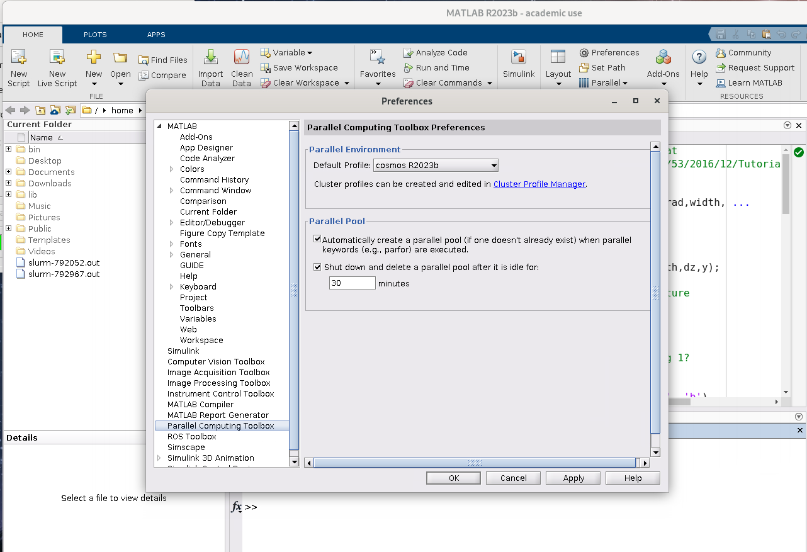
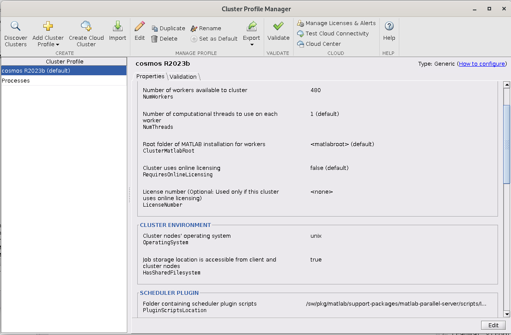
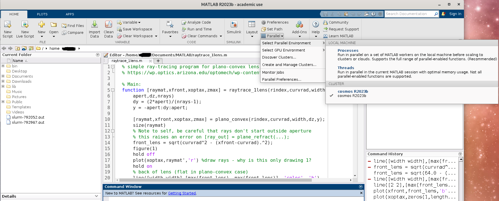
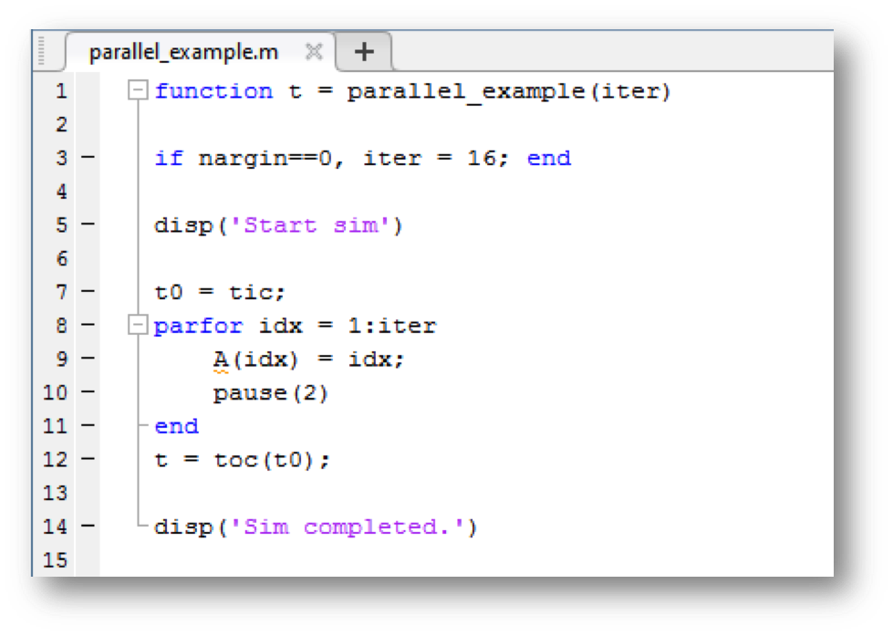
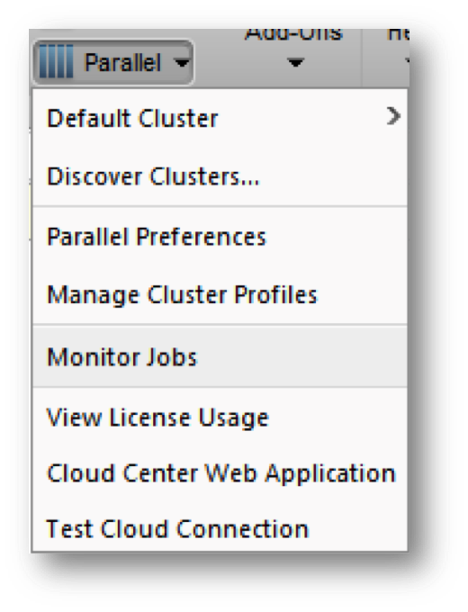

# MATLAB 

SNIC/NAISS provides a nationwide set of resources with the MATLAB Distributed Computing Server (MDCS) installed. At each respective NAISS centra the hosting university MATLAB licenses and toolboxes are available for use. 
 
The MATLAB versions available at LUNARC are:

```bash
Version        Module name

R2022a         matlab/2022a
R2023a         matlab/2023a
R2023b         matlab/2023b
```

## Getting started
### Running MATLAB on login-node 

MATLAB can be used on the login-nodes (either using LUNARC HPC Desktop i.e. ThinLinc. Or using SSH). Please note that, as these are shared resources, excessive use of MATLAB on the login-nodes will prevent other users from using the resources and may result in the offending jobs being killed without warning.
As MATLAB by default will use as many threads (cores) it possibly can, any user who is to use MATLAB on the login-nodes MUST start matlab with the option "-singleCompThread" thus preventing MATLAB from using more that one thread.
This will NOT prevent MATLAB from utilizing the MATLAB Distributed Computing Server (MDCS) with which any number of cores can be used for computations. You can also still send batch jobs on the local compute nodes this way if you correctly configure and instantiate a cluster profile, and call the batch method on that instance.

To start MATLAB on a login node, use: 

```bash
$ module load matlab/<version>
$ matlab -singleCompThread
```

To avoid starting the graphical interface, add the `-nodesktop -nodisplay` flags after the `-singleCompThread` flag.

On the LUNARC HPC Desktop (Thinlinc), these versions are available as Desktop On-Demand graphic interfaces via the Applications menu. Starting MATLAB from the menu automatically will set the -singleCompThread flag. This is now the recommended way to start MATLAB on the LUNARC HPC Desktop. Job configurations as described in the following sections can be entered at the Command Window in the MATLAB GUI, can be set and saved as a cluster profile, or can be configured at the MATLAB command line in the termninal.

### Loading and starting the module
The recommanded way to run MATLAB on cosmos is to log into the HPC desktop with Thinlinc, go to the Applications menu, mouse over `Applications - MATLAB`, and select your preferred version. This will launch a GfxLauncher window where you can specify the resources you need like your choice of node(s), the number of tasks per node, the walltime, etc. Once you press `start`, the MATLAB GUI will automatically launch on a backend node with a graphical partition, and the GfxLauncher window in the background will show how much of your walltime has been used.

Batch jobs and other parallelized scripts can be submitted to the slurm scheduler via the MATLAB GUI's Parallel Computing Toolbox. However, at this time the GUI cannot be closed while running such a job, and since running the GUI means that you have to use a GPU node, jobs run in this manner are limited to 48 hours.

If you need to use the command line for longer or less interactive jobs, whether on the front end or the interactive terminal, you will need to run these lines:

```bash
$ module load matlab/<version>
$ matlab -singleCompThread -nodesktop -nodisplay
```

and then submit scripts via the batch method of a cluster profile as discussed in the next section. Regardless of which terminal you use, the GUI will still launch if you do not include the flags `-nodesktop` and `-nodisplay`, so don't forget those if you need to run a job that lasts longer than 48 hours.

## Getting Started with Serial and Parallel MATLAB
### Cluster Configuration
There are two ways to configure MATLAB to run parallel jobs on your cluster depending on whether you want to run those jobs from the MATLAB GUI or from the command line. At the command line, users must call `configCluster` and set the parameters of the job with class methods of `ClusterInfo`. When running the GUI, users can go to a `Cluster Profile Manager` in `Parallel Settings` to set their job parameters and other constraints. Both ways are discussed in more detail below.

In both cases, cluster profile configuration only needs to be done once per version of MATLAB you use, but you can save more than one profile for the same version if you want.

#### Configuration at the Command Line

Load and start MATLAB.

For each cluster, `configCluster` only needs to be called once per version of MATLAB. This cluster profile will be automatically saved and made available from then on every time you load that version of MATLAB. 

```matlab
configCluster
```

Jobs will now default to the cluster rather than submit to the local machine.

Prior to submitting the job, we can specify various parameters to pass to our jobs, such as queue, e-mail, etc.  
Specification is done with `ClusterInfo`.  The `ClusterInfo` class supports tab completion to ease recollection of method names.
NOTE:  Any parameters set with ClusterInfo will be persistent between MATLAB sessions.

```matlab
% Specify a charge account						[REQUIRED]
ClusterInfo.setProjectName(‘name-of-account’)
% Set walltime to 1 hour    						[REQUIRED]
ClusterInfo.setWallTime(’01:00:00’)
% Specify a partition to run on
ClusterInfo.setQueueName(‘partition-name’)
% Specify e-mail address to receive notifications about your job
ClusterInfo.setEmailAddress(‘user@company.com’)
```

Additional parameters that can be supplied are:

* MemUsage (in megabytes)
* ProcsPerNode
* RequireExclusiveNodes
* Reservation
* UseGpu

Please note that as of version 2017a the syntax for setting the ClusterInfo parameters have changed. These are now properties of a `parcluster` object instead of methods in the `ClusterInfo` object.

```matlab
configCluster

% Set ProjectName and WallTime before submitting jobs
c = parcluster;
c.AdditionalProperties.ProjectName = 'project-name';
c.AdditionalProperties.WallTime = '01:00:00';
c.saveProfile
```

In the above example `c` is a `parcluster` object to which all properties are set accordingly.

To see the values of the current configuration options, call the state method.  To clear a value, assign the property an empty value (‘’, [], or false), or call the clear method to clear all values.

```matlab
% To view current configurations
ClusterInfo.state
% To clear a configuration that takes a string as an input argument
ClusterInfo.setEmailAddress(‘ ’)
% To clear all configurations
ClusterInfo.clear
```

#### Cluster Profiles in the GUI
If you have a common set of configurations you like to use for parallel computations on COSMOS, the MATLAB GUI provides a way to set these preferences and save them as one or more Cluster Profiles. From the main menu ribbon along the top, you can can either go to `Preferences` and select `Parallel Computing Toolbox` from the pop-up menu at left, or select `Parallel` and go to `Parallel Preferences` at the bottom of the drop-down menu. In both cases, the `Parallel Computing Toolbox Preferences` section will have a box where you can select a default profile if any profiles exist; otherwise, click `Cluster Profile Manager` to create one. (Please leave the boxes checked to automatically start the parallel pool if parallelized commands are detected in your code, and shut down idle parallel pools after 30 minutes.)

 

In the `Cluster Profile Manager`, the editor will let you can set the name of the profile, the number of workers (the total number of processes **minus 1**), and the default working directory for the job at the top. Most other job configuration parameters like your account, walltime, memory per node, number of tasks per node, GPUs per node, and whether to require an exclusive node are set lower down in the table under `Scheduler Plugin`. All the way at the bottom, you can select a preferred number and range of workers under the `Workers` tab, and here you can also pass copies of important environmental variables to the workers. To check that these settings work, after saving your edits, you will need to run the `Validate` command in the Cluster Profile Manager's top toolbar.

 

In the `Parallel` drop-down menu, hovering over `Select Parallel Environment` will reveal a second drop-down menu where previously-saved profiles will appear under the `Cluster Tab`.

 

Now whenever you start a `parpool` instance (i.e. the template for a group of tasks to be run in parallel) or use the `'pool'` option with a cluster's `batch` method, it will be generated with your default cluster profile settings, or the settings for whichever cluster profile you select as the default for the current session, if you don't pass any arguments or let another function start it anonymously.

In the GUI, if you want to generate one or more `parpool` instances with different settings but without changing which cluster profile is the default, you pass override arguments to `parpool` to change the number of workers and/or select a different cluster for only that instance of `parpool`. Alternative clusters can be passed by handle or by the name (string) of the cluster as defined in the cluster profile manager. But don't forget that only 1 `parpool` instance can be active at a time, and the settings can't be changed once the pool instantiated. An existing pool must be deleted and a new one instantiated to get a pool with different settings. Below is an example of how you might start a parallel pool for a small interactive parallel job. Batch mode is discussed in the next section for larger jobs and is still generally preferred.

```matlab
% start a default pool and get handle
poolobj = parpool;

% Oops, that has N workers but we need 2N.
% Delete the old one
delete(poolobj)
% Start a new pool with 2N workers (let's say N was 7)
pool2n = parpool(15);
% ...do stuff...

% clean up
delete(pool2n)

% Now we want to use a different cluster
% get handle for some other cluster profile
c = parcluster;
% start a pool with this profile and 31 workers
pool4n = parpool(c, 31);
% ...continue doing stuff...
```

It is also important to remember that **the number of workers is 1 less than the total number of processes that will be spawned**, because MATLAB implicitly spawns one additional process to manage overhead for the others. Therefore, if you want to run a parallel job using 1 task per CPU on a node with 32 CPUs, you must specify 31 workers to stay within that node.

### Running Jobs
#### Serial jobs

Use the batch command to submit asynchronous jobs to the cluster.  The batch command will return a job object which is used to access the output of the submitted job.  See the MATLAB documentation for more help on batch.

```matlab
% Get a handle to the cluster
c = parcluster;
% Submit a job to query where MATLAB is running on the cluster
j = c.batch(@pwd, 1, {});
% Query the job for the state
j.State
% If the state of the job is finished, fetch the results
j.fetchOutputs{:}
% Delete the job after the results are no longer needed
j.delete
```

To retrieve a list of running or completed jobs, call parcluster to retrieve the cluster object.  The cluster object stores an array of jobs that were run, are running, or are queued to run.  This allows us to fetch the results of completed jobs.  Retrieve and view the list of jobs as shown below.

```matlab
c = parcluster;
% Retrieve the results of past jobs from the cluster
jobs = c.Jobs
```

Once we’ve identified the job we want, we can retrieve the results as we’ve done previously. 

```matlab
% Retrieve the results of the 3rd job
j3 = jobs(3);
j3.fetchOutputs{:}
```

fetchOutputs is used to retrieve function output arguments; if calling batch with a script, use load instead.   Data that has been written to files on the cluster needs be retrieved directly from the file system.

#### Parallel jobs

Users can also submit parallel workflows with batch.  Let’s use the following example for our parallel job.

    

We’ll use the batch command again, but since we’re running a parallel job, we’ll also specify a MATLAB Parallel Pool.

```matlab
% Get a handle to the cluster
c = parcluster;
% Submit a batch pool job using 4 workers for 16 simulations
j = c.batch(@parallel_example, 1, {}, ‘Pool’, 4);
% View the current job status
j.State
% Fetch the results after the job is in the finished state
j.fetchOutputs{:}
ans = 
    8.8872
```

The job ran in 8.89 seconds using 4 workers.  Note that these jobs will always request N+1 CPU cores, since one worker is required to manage the batch job and pool of workers.   For example, a job that needs eight workers will consume nine CPU cores.  	
We’ll run the same simulation, but increase the Pool size.  This time, to retrieve the results at a later time, we’ll keep track of the job ID.
NOTE: For some applications, there will be a diminishing return when allocating too many workers, as the overhead may exceed computation time.    

```matlab
% Get a handle to the cluster
c = parcluster;
% Submit a batch pool job using 8 workers for 16 simulations
j = c.batch(@parallel_example, 1, {}, ‘Pool’, 8);
% Get the job ID
id = j.ID
id =
    4
% Clear the job variable, as though we quit MATLAB
clear j
```

Once we have a handle to the cluster, we’ll call the findJob method to search for the job with the specified job ID.  

```matlab
% Get a handle to the cluster
c = parcluster;
% Find the old job
j = c.findJob(‘ID’, 4);
% Retrieve the state of the job
j.State
ans
    finished
% Fetch the results
j.fetchOutputs{:}
ans = 
    4.7270
```

The job now runs in 4.73 seconds using 8 workers.  Run the code with different number of workers to determine the ideal number to use.
Alternatively, to retrieve job results via a graphical user interface (GUI), use the Job Monitor (Parallel > Monitor Jobs).

 


### Debugging

If a serial job produces an error, we can call the getDebugLog method to view the error log file.

```matlab
j.Parent.getDebugLog(j.Tasks(1))
```

When submitting independent jobs, with multiple tasks, you will have to specify the task number.  For Pool jobs, do not deference into the job object.

```matlab
j.Parent.getDebugLog(j)
```

The scheduler ID can be derived by calling schedID

```matlab
schedID(j)
ans
    25539
```

This is how the scheduler identifies the job.

## Learn more
To learn more about the MATLAB Parallel Computing Toolbox, check out these resources:

*	[Parallel Computing Coding Examples](http://www.mathworks.com/products/parallel-computing/code-examples.html)
*	[Parallel Computing Documentation](http://www.mathworks.com/help/distcomp/index.html)
*	[Parallel Computing Overview](http://www.mathworks.com/products/parallel-computing/index.html)
*	[Parallel Computing Tutorials](http://www.mathworks.com/products/parallel-computing/tutorials.html)
*	[Parallel Computing Videos](http://www.mathworks.com/products/parallel-computing/videos.html)
*	[Parallel Computing Webinars](http://www.mathworks.com/products/parallel-computing/webinars.html)

---

**Author:**
(LUNARC)

**Last Updated:**
2024-09-23
