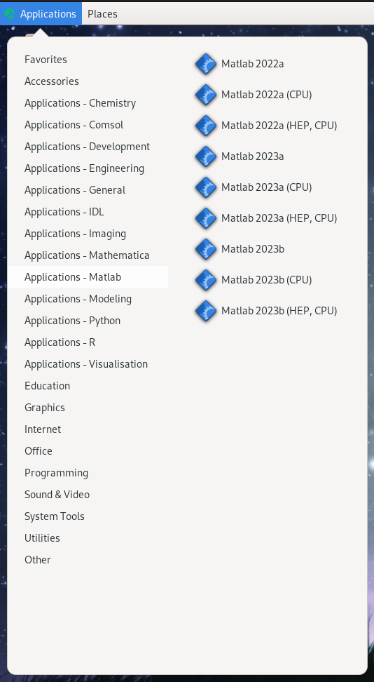
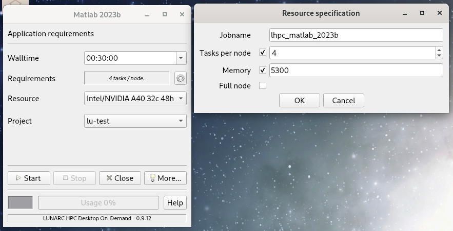
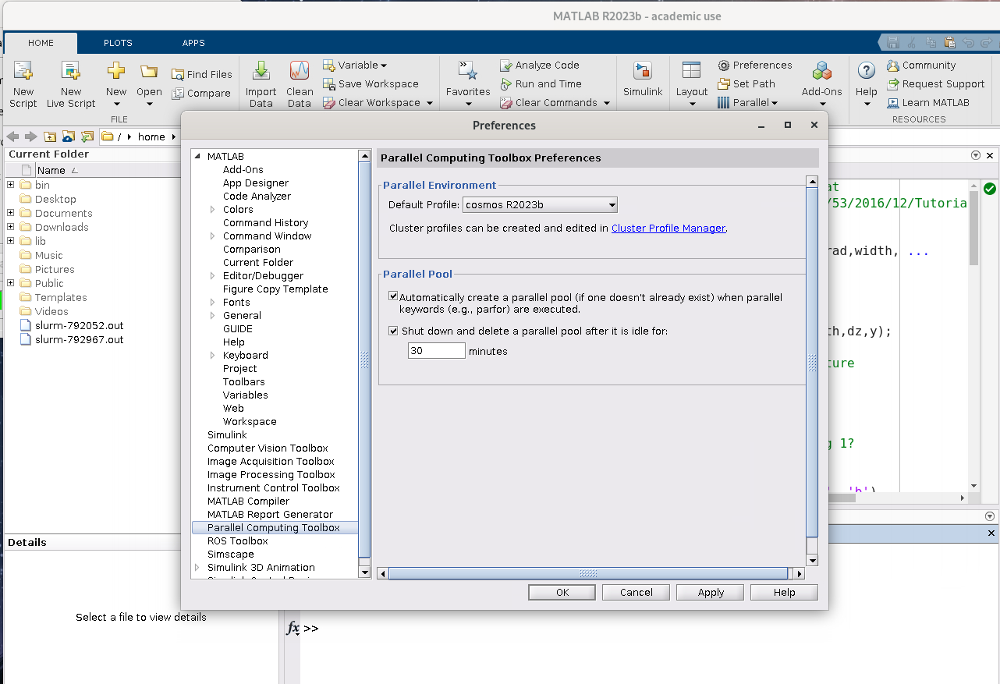
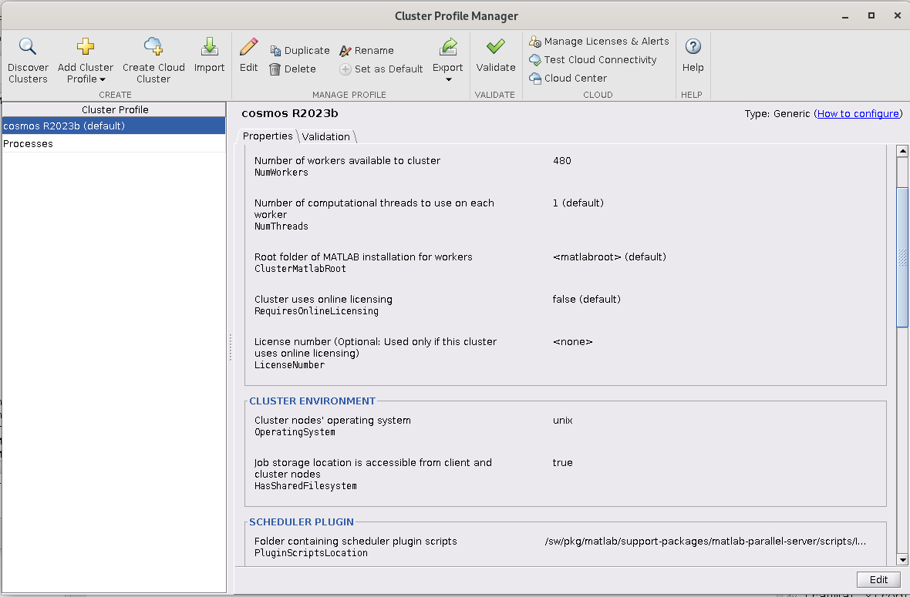
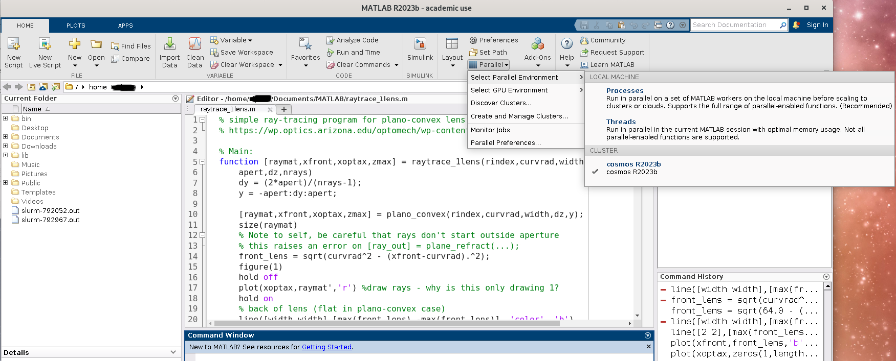
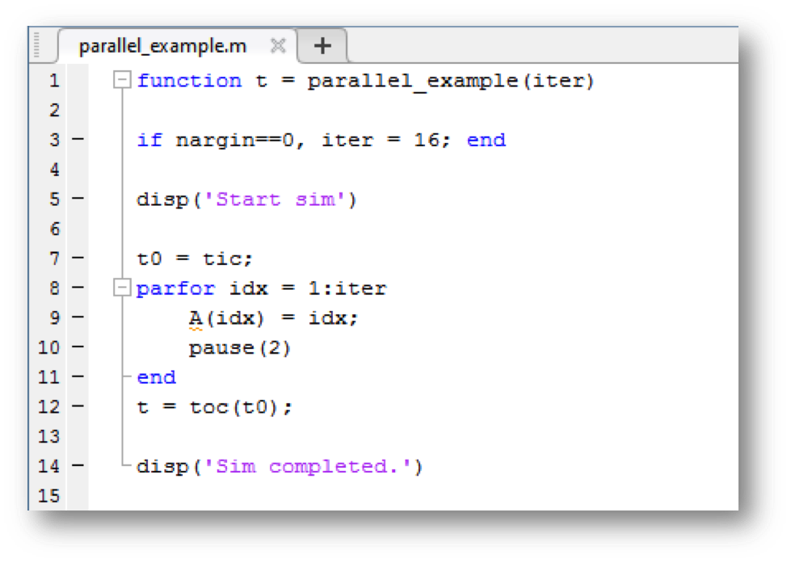
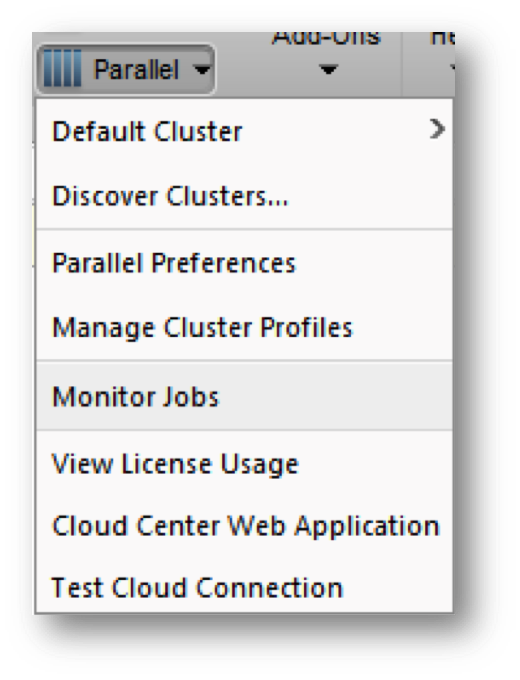

# MATLAB

NAISS provides a nationwide set of resources with the MATLAB Distributed Computing Server (MDCS) installed. At each respective NAISS centre the hosting university MATLAB licenses and toolboxes are available for use.

The MATLAB versions available at LUNARC are:

| Version | Module name |
| --- | --- |
| R2022a | `matlab/2022a` |
| R2023a | `matlab/2023a` |
| R2023b | `matlab/2023b` |

## Load and Run MATLAB

### Running the GUI with Desktop On-Demand (Recommended)

The recommended way to run MATLAB on COSMOS is to log into the LUNARC HPC desktop with ThinLinc, go to the Applications menu, mouse over `Applications - MATLAB`, and click your preferred version. For each release, you will see 3 versions. The release is up to you, but there are important differences between the 3 variants of each release:

- **Matlab R202Xy** — the regular version. It runs on a GPU-enabled node. Wall time is limited to 48 hours.
- **Matlab R202Xy (CPU)** — starts on a 48-core AMD CPU-only node. Graphics support is more limited, but wall time can be as long as 168 hours (7 days).
- **Matlab R202Xy (HEP,CPU)** — do not use this version unless you are a member of the group who owns these nodes.



This will launch a GfxLauncher window where you can specify the resources you need (node type, number of tasks, walltime, etc.). Once you press `Start`, the MATLAB GUI will automatically launch on a backend node and the GfxLauncher window will show how much of your walltime has been used. With this method, there is no need to load any modules in a terminal.



Batch jobs and parallelised scripts can be submitted to the SLURM scheduler via the MATLAB GUI's Parallel Computing Toolbox once you have established a cluster profile (see the Configuration section). **The settings you enter for a cluster profile in the Parallel Computing Toolbox are distinct from those you set at the GfxLauncher for running the GUI.** Batch jobs are not bound by the parameters you set at the GfxLauncher. As long as you save your outputs to a directory with sufficient space, you are free to close the GUI and fetch your results later.

### Load and Run MATLAB in the terminal

If you want to use the command line for less interactive jobs or SLURM scripts that call other programs besides MATLAB, you can run MATLAB in a terminal instead of launching the GUI. There are 2 options for starting a terminal session on the HPC desktop depending on which nodes you want to use: the interactive terminal in `Applications` → `Applications - General`, which runs on the compute nodes, and the regular terminal that appears in `Favorites`, which runs on the login nodes. Regardless of which one you use, run:

```bash
module load matlab/<version>
matlab -singleCompThread -nodisplay
```

The flag `-nodisplay` is required to keep the GUI from launching. You can then submit scripts via the batch method of a cluster profile as discussed in the Configuration section below.

As MATLAB by default will use as many threads (cores) as it can, any user who is to use MATLAB on the login nodes **must start MATLAB with the option `-singleCompThread`** to prevent MATLAB from using more than one thread. This will **not** prevent MATLAB from using the MATLAB Distributed Computing Server (MDCS) for multi-core computations.

#### Running MATLAB on login node (not recommended)

MATLAB can be used on the login nodes (via ThinLinc or SSH), but the login nodes are shared resources. Intensive use of MATLAB on the login nodes will prevent other users from utilising their requested resources. LUNARC administrators will kill any jobs associated with such misuse and send a warning to the user.

Users who run on the login nodes should:

- Use the terminal interface (i.e. set `-nodisplay`) to keep resource usage low.
- Run most scripts via the cluster profile's batch method whenever possible.
- Keep scripts run outside of batch mode quick (< 30 min) and strictly serial.
- **Always start MATLAB with `-singleCompThread`** when on the login nodes.

## Getting Started with Serial and Parallel MATLAB

### Cluster Configuration

There are two ways to configure MATLAB to run parallel jobs depending on whether you run from the MATLAB GUI or from the command line.

Either way, cluster profile configuration only needs to be done once per version of MATLAB you use, but you can save more than one profile for the same version.

#### Configuration at the Command Line

Load and start MATLAB.

`configCluster` only needs to be called once per version of MATLAB. This cluster profile will be automatically saved and made available every time you load that version.

```matlab
configCluster
```

Jobs will now default to the cluster rather than the local machine.

Prior to submitting a job, specify various parameters using `ClusterInfo`. The `ClusterInfo` class supports tab completion.

```matlab
% Specify a charge account                        [REQUIRED]
ClusterInfo.setProjectName('name-of-account')
% Set walltime to 1 hour                          [REQUIRED]
ClusterInfo.setWallTime('01:00:00')
% Specify a partition to run on
ClusterInfo.setQueueName('partition-name')
% Specify e-mail address for job notifications
ClusterInfo.setEmailAddress('user@company.com')
```

Additional parameters that can be supplied:

- MemUsage (in megabytes)
- ProcsPerNode
- RequireExclusiveNodes
- Reservation
- UseGpu

Please note that as of version 2017a the syntax for setting ClusterInfo parameters has changed. These are now properties of a `parcluster` object:

```matlab
configCluster

% Set ProjectName and WallTime before submitting jobs
c = parcluster;
c.AdditionalProperties.ProjectName = 'project-name';
c.AdditionalProperties.WallTime = '01:00:00';
c.saveProfile
```

To see current configuration options, call the state method. To clear a value, assign an empty value (`''`, `[]`, or `false`), or call the clear method:

```matlab
% View current configurations
ClusterInfo.state
% Clear a string configuration
ClusterInfo.setEmailAddress(' ')
% Clear all configurations
ClusterInfo.clear
```

#### Modifying Cluster Profiles in the GUI

The MATLAB GUI provides a Cluster Profile Manager accessible via `Preferences` → `Parallel Computing Toolbox` or `Parallel` → `Parallel Preferences`.

**If there is no default profile, it is strongly recommended to run `configCluster` at the MATLAB command line first**, as there are a number of settings provided by that script that users would not be expected to know.



In the `Cluster Profile Manager` you can set or modify:

- the name of the profile
- the default number of workers (total processes **minus 1**)
- the default working directory for the job
- your account name
- the required walltime
- the number of tasks per node
- the memory per node
- the number of GPUs per node (optional)
- the range of numbers of workers to allow
- whether to require an exclusive node (default is false)

Most familiar SBATCH parameters are set in a box near the bottom titled "Scheduler Plugin". After saving your edits, run the `Validate` command to check that the settings work.



In the `Parallel` drop-down menu, hovering over `Select Parallel Environment` will reveal a second drop-down where previously-saved profiles appear under the `Cluster Tab`.



Now whenever you start a `parpool` instance or use the `'pool'` option with a cluster's `batch` method, it will be generated with your default cluster profile settings.

```matlab
% start a default pool and get handle
poolobj = parpool;

% Delete and start a new pool with a different size
delete(poolobj)
pool2n = parpool(15);
% ...do stuff...
delete(pool2n)

% Use a different cluster profile
c = parcluster;
pool4n = parpool(c, 31);
% ...continue doing stuff...
```

Note that **the number of workers is 1 less than the total number of processes spawned**, because MATLAB implicitly spawns one additional process to manage overhead. Therefore, if you want to run a parallel job using 1 task per CPU core on a 48-core node, you must specify 47 workers.

### Running Jobs

#### Serial jobs

Use the `batch` command to submit asynchronous jobs to the cluster.

```matlab
% Get a handle to the cluster
c = parcluster;
% Submit a job to query where MATLAB is running on the cluster
j = c.batch(@pwd, 1, {});
% Query the job state
j.State
% If finished, fetch the results
j.fetchOutputs{:}
% Delete the job after results are no longer needed
j.delete
```

To retrieve a list of running or completed jobs:

```matlab
c = parcluster;
jobs = c.Jobs
```

Once you have identified the job you want:

```matlab
% Retrieve the results of the 3rd job
j3 = jobs(3);
j3.fetchOutputs{:}
```

`fetchOutputs` retrieves function output arguments; if calling batch with a script, use `load` instead. Data written to files on the cluster must be retrieved directly from the file system.

#### Parallel jobs

Users can also submit parallel workflows with batch.



```matlab
% Get a handle to the cluster
c = parcluster;
% Submit a batch pool job using 4 workers for 16 simulations
j = c.batch(@parallel_example, 1, {}, 'Pool', 4);
% View the current job status
j.State
% Fetch the results after the job is in the finished state
j.fetchOutputs{:}
ans =
    8.8872
```

Note that these jobs always request N+1 CPU cores, since one worker manages the batch job and pool. For some applications there will be a diminishing return when allocating too many workers, as overhead may exceed computation time.

```matlab
% Submit a batch pool job using 8 workers
c = parcluster;
j = c.batch(@parallel_example, 1, {}, 'Pool', 8);
% Get the job ID
id = j.ID
id =
    4
clear j
```

To retrieve results later:

```matlab
c = parcluster;
j = c.findJob('ID', 4);
j.State
ans
    finished
j.fetchOutputs{:}
ans =
    4.7270
```

Alternatively, use the Job Monitor (`Parallel` → `Monitor Jobs`).



### Debugging

If a serial job produces an error, call `getDebugLog` to view the error log:

```matlab
j.Parent.getDebugLog(j.Tasks(1))
```

For pool jobs, do not dereference into the job object:

```matlab
j.Parent.getDebugLog(j)
```

The scheduler ID can be derived with:

```matlab
schedID(j)
ans
    25539
```

## Learn more

- [Parallel Computing Coding Examples](http://www.mathworks.com/products/parallel-computing/code-examples.html)
- [Parallel Computing Documentation](http://www.mathworks.com/help/distcomp/index.html)
- [Parallel Computing Overview](http://www.mathworks.com/products/parallel-computing/index.html)
- [Parallel Computing Tutorials](http://www.mathworks.com/products/parallel-computing/tutorials.html)
- [Parallel Computing Videos](http://www.mathworks.com/products/parallel-computing/videos.html)
- [Parallel Computing Webinars](http://www.mathworks.com/products/parallel-computing/webinars.html)

---

**Author:**
(LUNARC)

**Last Updated:**
2024-09-23
