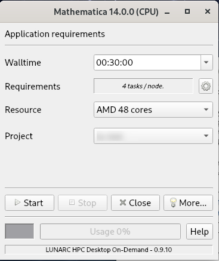
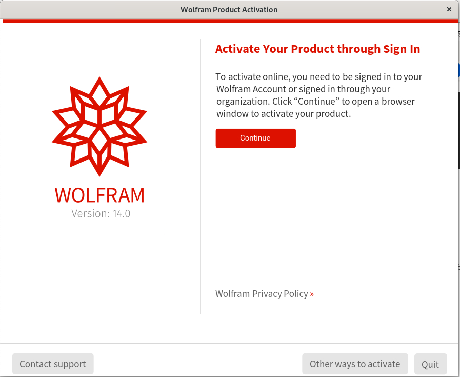
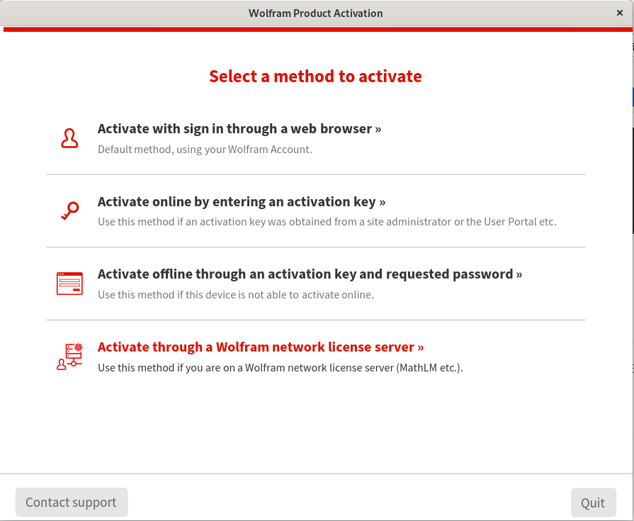
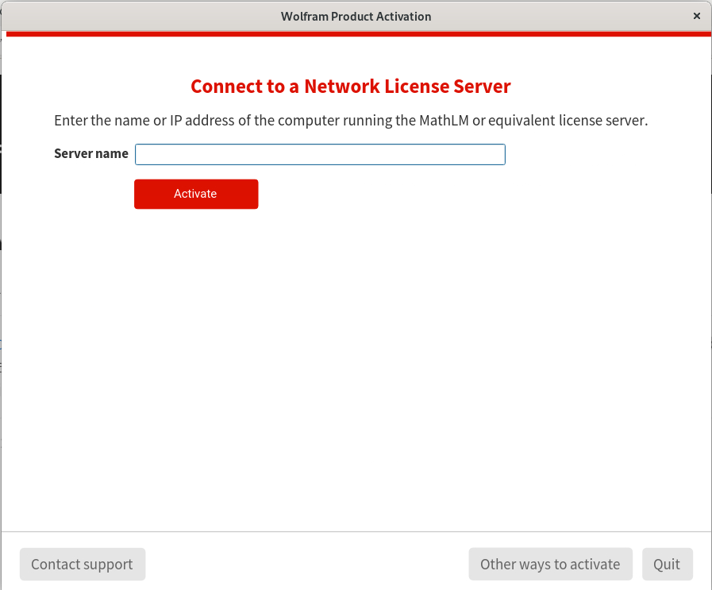

# Mathematica
Mathematica is a computational software program used in many scientific, engineering, mathmatical and computing fields.

## Starting Mathematica on COSMOS
Mathematica is gui based and likely to consume significant resources such as CPU time and/or memory.  Resource intensive Mathematica sessions must not be started on the login nodes.  We recommend starting Mathematica as an on-demand application using the [graphical application launcher](../../getting_started/gfxlauncher.md).  
You get a gui similar to:

 

* Adjust the walltime to your needs. The session will be terminated once the requested time has elapsed.  Do not request excessive amounts of time, if you do not manually terminate the sesssion and the session keeps running, your project gets charged for the full time.
* Due to licensing issues, do not utilise more than 4 tasks, which is the default setting.
* Choose the relevant project
* Press start.  The Mathematica gui will start once resources are available.  This might take a moment or two.

## Licensing
LUNARC does not have a Mathematica license.  To use Mathematica on COSMOS, you have to bring your own license.  Assuming your license is held on a MathLM or equivalent license server the Mathematica gui can be utilised to connect to the license server. On launch you get the following screen:

 

Select: *Other ways to activate*

 

Select: *Activate through a Wolfram network license server*

Enter the address of your license server into the next window and press **activate**.  You have to obtain the address of your license server from the manager of your Mathematica license.   LUNARC does not know this.

