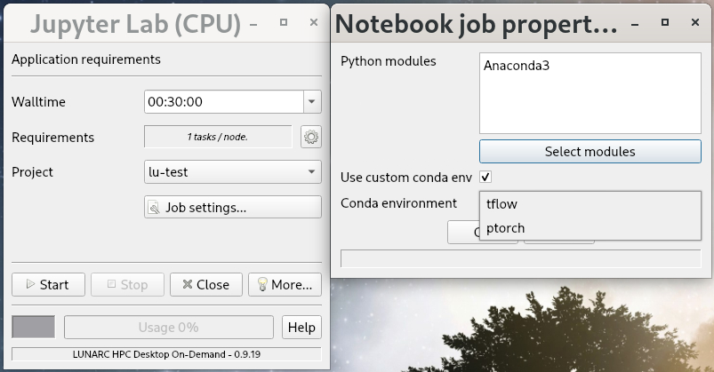
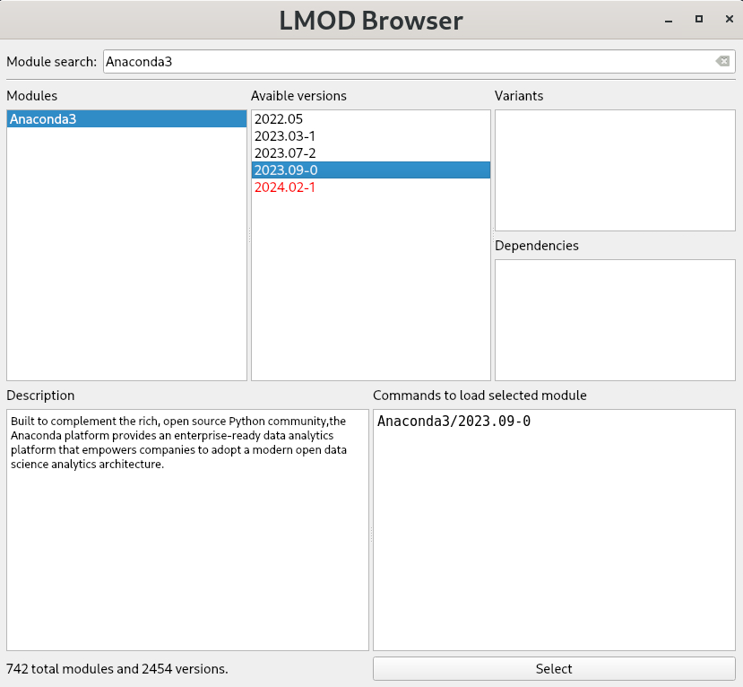
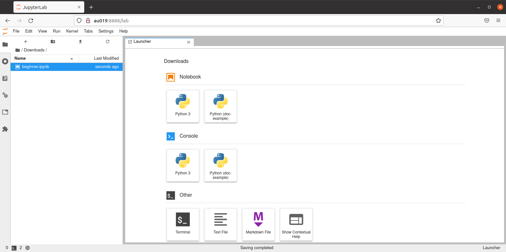
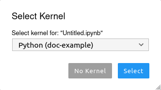
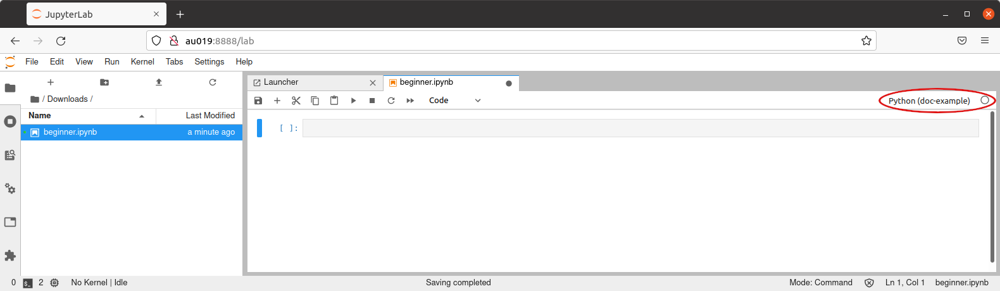

# Python

## Overview

Python is available on the cluster. Depending on the user's experience and needs, different distributions are available. Below is a non-exhaustive list of installed distributions:

- Anaconda2
- Anaconda3
- Python
- Biopython

Information on available versions can be obtained with the command:

```bash
module spider <distribution-name>
```

where `<distribution-name>` is replaced with the name of the distribution you are interested in. For example, to list all installed versions of the Python distribution:

```bash
module spider Python
```

To activate a specific version, enquire about it to find the prerequisites, then load them together with the Python module. For example, for Python 3.6.6:

```bash
module spider Python/3.6.6
```

This provides information about which compiler, CUDA, and/or MPI library combinations are available for that version. Note that the latest `Python` modules do not include packages such as MPI4PY, numpy, or scipy — for these you need to load a `SciPy-bundle`. See [below](#python-distributions-requiring-a-gcccore-module).

Please note that to use a distribution that requires CUDA you need to have access to a GPU partition project. For more information on how to use the module system consult the [modules guide](../../manual/manual_modules.md).

## Recommended use

Depending on the needs of the user, we recommend different distributions.

### Anaconda distributions

For users **without special requirements**, the recommended distribution is Anaconda. Anaconda is provided for Python versions 2 and 3, named **Anaconda2** and **Anaconda3** respectively. These are also the recommended distributions for users who wish to use the interactive environment **spyder**, though spyder is also provided for a few selected versions of the Python distribution.

To get the full functionality of the Anaconda environment use the following commands:

```bash
module load Anaconda3
source config_conda.sh
```

This enables the full functionality of the `conda` command.

### Creating conda environments

To create reproducible and custom environments with specific versions of Python, NumPy, or any other packages, users are encouraged to create and install packages into a dedicated conda environment. Make sure you have loaded Anaconda3 and activated the conda command with:

```bash
source config_conda.sh
```

Now create a new environment:

```bash
conda create -n myenv
```

This will start the process of creating a new environment:

```bash
Collecting package metadata (current_repodata.json): done
Solving environment: done

## Package Plan ##

  environment location: /home/bmjl/.conda/envs/myenv

Proceed ([y]/n)?
```

Press **y** to start the process. When the environment has been created:

```bash
Preparing transaction: done
Verifying transaction: done
Executing transaction: done
#
# To activate this environment, use
#
#     $ conda activate myenv
#
# To deactivate an active environment, use
#
#     $ conda deactivate
```

When installing packages into the environment, it is recommended to install all necessary packages at once so that conda can reconcile dependencies. **If you plan to use this environment in Jupyter Lab or Jupyter Notebook, include `ipykernel` and `ipython_genutils`**:

```bash
conda install -n myenv ipykernel ipython_genutils numpy scipy ...
```

For more information, see the [Conda documentation on creating and managing environments](https://docs.conda.io/projects/conda/en/latest/user-guide/tasks/manage-environments.html#creating-an-environment-with-commands).

Once the environment is built, activate it using:

```bash
conda activate myenv
```

When activated, all package installations (both conda and pip) go into this environment and will not interfere with the base conda environment.

The current default Anaconda and Miniforge modules should be configured to run `source config_conda.sh`, which allows the use of `conda` commands in SLURM submission scripts. Older versions may still require `source config_conda.sh` explicitly before any `conda` commands in SLURM scripts.

### Python distributions

Users planning **larger scale calculations** potentially using MPI4PY, or requiring specific compilers and libraries, should use the distribution named **Python**. Note that these require loading prerequisites — compilers, MPI and/or CUDA libraries — as detailed in the [Overview section](#overview).

There are several versions of toolchains such as foss or intel, each with multiple versions of Python. After choosing a toolchain, use `module avail Python` to see available versions.

#### Python distributions requiring a GCCcore module

Starting in 2019, the prerequisites and site-package contents of distributions named *Python* changed significantly. These modules can be loaded after loading a **GCCcore** compiler as shown in the `module spider` output. They do not contain site-packages depending on an MPI or BLAS library (such as MPI4PY, numpy, or scipy). To access such packages, load a **SciPy-bundle** module, which requires a compiler and MPI module. Use `module spider SciPy-bundle` to see what is available.

By default SciPy-bundle will load a Python 3 module. If you require Python 2, load it before loading SciPy-bundle.

### Biopython

For users working in **bioinformatics**, one of the Biopython packages is most likely the desired choice.

### Bioconda

There are two large Bioconda environments developed as modules for users who need Bioconda software with AI/ML applications:

- `bioconda/bio-suite-py3.10-tf` — built around Keras and TensorFlow with Python 3.10
- `bioconda/bio-suite-py3.12-torch` — built around PyTorch with Python 3.12

These are built to fit as many compatible biostatistics packages as possible. Only one conda environment can be active at a time (no additional conda-based modules can be loaded on top). The full list of installed packages can be viewed with `conda list`, and specific packages searched with `conda list | grep <package_name>`. Users cannot `conda install` new packages themselves, but may submit installation requests to LUNARC support.

## Python site-packages (aka. Python packages)

The distributions provided by LUNARC have a large number of site-packages installed. Users are encouraged to verify that all needed packages are in place.

Anaconda users can check installed packages with:

```bash
conda list
```

All other installations use the *pip* framework:

```bash
pip list
```

### LUNARC installed packages

LUNARC staff will install packages in the various distributions (mainly in the non-Anaconda-based ones). If you have packages that may be of use for other users, or if you are having trouble installing a package, please send a support request and LUNARC staff will consider it for inclusion.

### User installed packages

Users are also able to install their own packages by creating their own local repository.

#### Anaconda Python distributions

In **Anaconda** the user can create their own environment using `conda create` and `conda install`. See the [Conda environments documentation](https://conda.io/docs/user-guide/tasks/manage-environments.html) for details.

**Please note:** The `.conda` directory where installed files are located may become large. The default location is in `/home/<username>`. If space is a problem, consider using your project's nobackup directory instead.

#### Other Python installations

In all other installations (default or loadable module) users can install their own packages using *pip*:

```bash
pip install --prefix=$HOME/local package_name
```

This installs `package_name` into the user's home directory. **Make sure the installation location is added to your `$PYTHONPATH` environment variable** (e.g. via a private module file or sourcing a script). The `--install-option` flag to redirect the installation location is no longer recommended.

Always check using `pip list` or `conda list` whether the package is already installed in the selected distribution.

## Jupyter Lab

### On-Demand Jupyter Lab

LUNARC provides [Jupyter Lab](https://jupyter.org/) on compute nodes through Anaconda, accessible from the [On-Demand Applications menu](../getting_started/gfxlauncher.md). Jupyter Lab depends on Anaconda3 but can be configured to use other versions of Anaconda3 and can load custom conda environments built with the same conda version.

The On-Demand Jupyter Lab running script gives access to a wide variety of modules: AstroPy, BeautifulSoup, Scikit-Learn, Seaborn, and more. The full list can be viewed with:

```bash
less /sw/pkg/gfxlauncher/conda/environment.yml
```

If everything you need is on that list with a suitable version, starting Jupyter is exactly as demonstrated in the [on-demand applications documentation](../getting_started/gfxlauncher.md). Otherwise, [create a custom conda environment](#creating-conda-environments) and [enable it as a kernel](#building-and-installing-a-custom-jupyter-lab-kernel).

### Jupyter Lab via Interactive Terminal

Jupyter Lab can also be run from an [interactive terminal session](../../manual/manual_interactive.md), although you will have to manually copy and paste the link into a browser. This works best using the [LUNARC HPC Desktop](../getting_started/using_hpc_desktop.md).

Start an [interactive session](../../manual/manual_interactive.md) or choose one of the interactive terminals in the On-Demand Applications menu. For Jupyter Lab, the recommended terminal is under `Applications - Visualization`. Once the terminal is open, load Anaconda and start:

```bash
jupyter-lab --ip=$HOSTNAME
```

After a few seconds, Jupyter Lab outputs logs such as:

```text
[I 11:49:07.211 LabApp] JupyterLab extension loaded from /sw/easybuild/software/Anaconda3/2020.11/lib/python3.8/site-packages/jupyterlab
[I 11:49:07.214 LabApp] Serving notebooks from local directory: /home/username
[I 11:49:07.215 LabApp] Jupyter Notebook 6.1.4 is running at:
[I 11:49:07.215 LabApp] http://cn001:8888/?token=a59a11155605a8038b5d61cdab7fde987d56d244b9284fbe
[I 11:49:07.215 LabApp]  or http://127.0.0.1:8888/?token=a59a11155605a8038b5d61cdab7fde987d56d244b9284fbe
[I 11:49:07.215 LabApp] Use Control-C to stop this server and shut down all kernels (twice to skip confirmation).

    To access the notebook, open this file in a browser:
        file:///home/username/.local/share/jupyter/runtime/nbserver-22442-open.html
    Or copy and paste one of these URLs:
        http://cn001:8888/?token=a59a11155605a8038b5d61cdab7fde987d56d244b9284fbe
     or http://127.0.0.1:8888/?token=a59a11155605a8038b5d61cdab7fde987d56d244b9284fbe
```

The line containing the hostname (e.g. `cn001`) and token **must** appear in the output. The hostname depends on the allocated compute node and the token is unique to your session. You **cannot** use the link with hostname `127.0.0.1` or `localhost`.

Copy the full URL with the hostname and paste it into a browser running in the LUNARC HPC Desktop.

!!! warning "Share with caution"
    Any user with whom you share this link can read and write all files in any subdirectory from where Jupyter Lab was started.

### Virtual environments

If Jupyter Lab lacks additional packages you need, a customised Jupyter Lab kernel can be a solution.

#### Building and installing a custom Jupyter Lab kernel

[Create a new virtual Anaconda environment](#creating-conda-environments) and make sure it includes `ipykernel`, `ipython_genutils`, and any other required packages. Then activate the environment and register the kernel:

```bash
python -m ipykernel install --user --name "$KERNEL_NAME" --display-name "$KERNEL_DISPLAY_NAME"
```

where `$KERNEL_NAME` is the name you choose (e.g. `tensorflow`) and `$KERNEL_DISPLAY_NAME` is its human-readable label (e.g. `Python (TensorFlow)`).

The new kernel is now ready to use. Proceed with starting Jupyter Lab as [described above](#jupyter-lab).

**Interactive terminal:** Activate the conda virtual environment after the interactive session has started and before starting Jupyter Lab.

**Jupyter Lab On-Demand:** In the GfxLauncher popup, click "Job settings" below the Project dropdown. In the "Notebook job properties" popup, select "Use custom conda environment" and choose your environment from the dropdown.



If you used an older version of Anaconda3, before selecting your conda environment click "Select Modules", go to the "LMOD Browser" popup, and click the `Anaconda3` listed in the Modules box at left. Select the version you want and click "Select".



#### Running your custom kernel

Once registered and Jupyter Lab is opened, try importing a module unique to your environment. The kernel may appear in the Notebook or Console sections of the Jupyter Lab launcher page:



or in the menu `Kernel` > `Change Kernel...`:



The kernel in use is shown in the upper-right corner:



#### Removing a custom kernel

Activate the corresponding conda environment and run:

```bash
jupyter kernelspec uninstall $KERNEL_NAME
```

where `$KERNEL_NAME` is the name of the kernel to remove.

---

**Author:**
(LUNARC)

**Last Updated:**
2025-03-26
