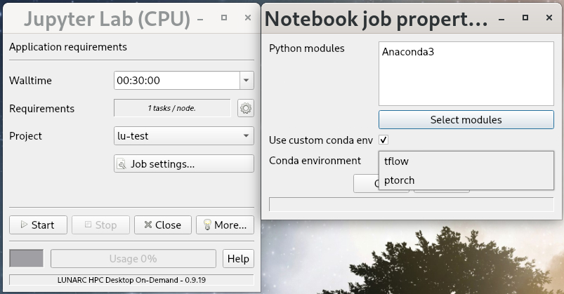

# Python

## Overview

Python is available on the cluster. Depending on the users experience and needs, different distributions are available. Below is an non-exhaustive list of installed distributions:

* Anaconda2 
* Anaconda3
* Python
* Biopython
        
Information, such as available versions, on these distributions can be had using the command 

```bash
module spider <distribution-name>
```

where one has to replace the `distribution-name` with the name of the distribution on is interested in.  For example, when being interested in a specific version of the Python distribution.

```bash
module spider Python
```
        
will list all the Python versions of the Python distribution we have installed.  To activate the version, one needs to enquire about the details of a specific version, load the prerequisites (e.g. compiler, MPI library, etc.) and the Python distribution.  E.g. when being interested in Python version 3.6.6 the command

```bash
module spider Python/3.6.6
```
        
will provide information for which combination of compiler, CUDA and/or MPI library that version of Python is available.  Note that the latest `Python`modules lack packages such as MPI4PY, numpy and scipy.  For this you need to load a `SciPy-bundle`.  See below [for details](#python-distributions-requiring-a-gcccore-module).

Please note to utilise a distribution that requires CUDA, you need to have access to an LU Local or LVIS ([HPC Desktop On-Demand](http://www.lunarc.lu.se/resources/services/lunarc-hpc-desktop-on-demand/)) project.  For more information on how to use the module system consult our separate [guide on using the installed software](https://lunarc-documentation.readthedocs.io/en/latest/aurora_modules/).

## Recommended use

Depending on the needs of the user, we recommend different distributions.

### Anaconda distributions

For users **without special requirements**, the recommended distribution is the Anaconda. Anaconda is provided for Python versions 2 and 3.  The modules are named **Anaconda2** resp. **Anaconda3**.  These are also the recommended distribution for users who whish to use the interactive environment **spyder**, though spyder is also provided for a few selected versions of the Python distribution. 

To get the full functionality of the Anaconda environment should use the following commands:

```bash
module load Anaconda3
source config_conda.sh
```

This enables the full functionality of the **conda** command. 

### Creating conda environments

To be able to create reproducable and custom environments with specific versions of Python, NumPy, or any other packages, users are encouraged to create and install packages into a specific conda environment. To create a new conda environment make sure that you have loaded Anaconda3 (take note of the version), and have activated the conda command with

```bash
source config_conda.sh
```

Now you can create a new environment with the following command:

```bash
conda create -n myenv
```
        
This will start the process of creating a new environment:

```bash
Collecting package metadata (current_repodata.json): done
Solving environment: done

## Package Plan ##

  environment location: /home/bmjl/.conda/envs/myenv

Proceed ([y]/n)?
```
        
Press **y** to start the process. When the environment has been created the following is shown:

```bash
Preparing transaction: done
Verifying transaction: done
Executing transaction: done
#
# To activate this environment, use
#
#     $ conda activate myenv
#
# To deactivate an active environment, use
#
#     $ conda deactivate
```

When installing packages to this environment, it is recommended to install all necessary packages at once so that conda can reconcile the dependencies. **If you plan to use this environment in Jupyter Lab or Jupyter Notebook, you will need to include the packages `ipykernel` and `ipython_genutils`**. The command to install packages to your environment will look something like this (remove or replace the "..." with more packages as desired):

```bash
conda install -n myenv ipykernel ipython_genutils numpy scipy ...
```

For more information, [see this section of the Conda documentation on creating and managing environments](https://docs.conda.io/projects/conda/en/latest/user-guide/tasks/manage-environments.html#creating-an-environment-with-commands).

Once the environment is built, you can activate it using 

```bash
conda activate myenv
```
        
When activated all package installations, both conda and pip, goes into this environment and will not interfere with the base conda environment.

The current default Anaconda and Miniforge modules should now be configured to run `source config_conda.sh`, which will allow the use of the `conda` commands in SLURM submission scripts, but older versions may still require `source config_conda.sh` before any `conda` commands in SLURM scripts.

### Python distributions

Users who are planning to do **larger scale calculations** potentially using MPI4PY or requiring specific compilers and libraries, the recommended distribution is named **Python**. Please note that this these require loading of pre-requisites, such as compilers, MPI and/or CUDA libraries, as detailed in the [Overview section](#overview). 
 
Please note that there are several versions of the toolchains such as the foss or intel toolchain.  Each with multiple versions of Python.  Please choose the one appropriate for you. Note that after having chosen your toolchain use **module avail Python** to see versions available.

For more information on available toolchains see [compiling-code-and-using-toolchains](http://lunarc-documentation.readthedocs.io/en/latest/aurora_modules/#compiling-code-and-using-toolchains)

#### Python distributions requiring a GCCcore module
Starting in 2019, the pre-requisites and site-package contents of the distributions named *Python* have changed significantly.  The modules can be loaded after loading a **GCCcore** compiler, which is show in the output of the `module spider` command.  These *Python* distributions do not contain site-packages depending on an MPI or BLAS library, such as MPI4PY, numpy or scipy.  To access such MPI and/or BLAS dependent packages loading a **SciPy-bundle**-module is required, which require a compiler and an MPI module.  Use `module spider SciPy-bundle` to see what is available.

By default the SciPy-bundle will load a Python 3 module.  If you require a Python 2 module, load that prior to loading SciPy-bundle.

### Biopython

For users working in **bioinformatics** on of the Biopython packages is most likely the desired one.
 

## Python site-packages (aka. Python packages)

The distribuitons provided by LUNARC have large number of site-packages (aka. Python packages) installed. Users are encouraged to list the set of installed packages to verify that all needed packages are in place.

Anaconda users can check the installed packages with:

```bash
conda list
```

All other installations are using the *pip* framework:

```bash
pip list
```

### LUNARC installed packages

LUNARC staff will install packages in the various distributions (mainly in the non-Anaconda-based ones). If you have packages that may be of use for other users, or if you are having trouble installing a package, please send a support request for the installation of the package and LUNARC staff will consider it for inclusion in the distribution. 

### User installed packages

Users are also able to install their own packages by creating their own local repository.

#### Anaconda Python distributions

In **Anaconda** (available as a loadable module) the users are free to create their own environment. The user cen either use the pre-installed environment or create an empty environment and populate it with packages that the user chooses using `conda create` and `conda install`. Please review: <a target="_blank" href="https://conda.io/docs/user-guide/tasks/manage-environments.html"> Manage environments (new window)</a> for information on how to use environments in conda. 

**Please note:** The `.conda` directory where the installed-files are located may become large which may become a problem as the default location for this directory is in `/home/< username >`. If space is a problem, users should consider using `/lunarc/nobackup` instead.

#### Other Python installations

In all other installations (default or loadable module) users can install their own packages using *pip*

```bash
pip install --prefix=$HOME/local package_name
```

This will install the package *package_name* in the users home-directory. **Make sure the installation location of your packages gets added to your `$PYTHONPATH` environment variable** (e.g. private module file, sourceing a script, ...). For this to work you need a Python package with a recent version of `pip`.  The use of the `--install-option` to redirect the installation location is no longer recommended.

Again, *please* check using `pip list` or `conda list` if the package is already installed in the selected distribution. 

## Jupyter Lab

### On-Demand Jupyter Lab
LUNARC provides means to run <a href="https://jupyter.org/">Jupyter Lab</a> in compute nodes through Anaconda. It is now possible to run Jupyter Lab (and the older Jupyter Notebook) from the [On-Demand Applications menu](https://lunarc-documentation.readthedocs.io/en/latest/getting_started/gfxlauncher/). Jupyter Lab depends on Anaconda3, but can be configured to run versions of Anaconda3 other than the default version. It can also now load custom conda environments as long as those enviroments are run with the conda version used to build them.

The On-Demand Jupyter Lab running script is configured to give users access to a wide variety of modules that users might otherwise expect to have to load: AstroPy, BeautifulSoup, Scikit-Learn, Seaborn, and more. The full list of modules imported can be viewed with 

```bash
less /sw/pkg/gfxlauncher/conda/environment.yml 
```

If everything you need is on that list with a suitable version number, the process of starting Jupyter is exactly as demonstrated in the [on-demand applications documentation](https://lunarc-documentation.readthedocs.io/en/latest/getting_started/gfxlauncher/). Otherwise, you will need to <a href="#creating-conda-environments">create a custom conda environment</a> and <a href="#building-and-installing-a-custom-jupyter-lab-kernel">enable it as a kernel</a>.

### Jupyter Lab via Interactive Terminal
Alternatively, Jupyter Lab can be run from an <a href="https://lunarc-documentation.readthedocs.io/en/latest/manual/manual_interactive/">interactive terminal session</a>, although you will have to manually copy and paste the link into a browser. This procedure still works best using the <a href="/using_hpc_desktop">LUNARC HPC Desktop</a>. 

First, start an <a href="https://lunarc-documentation.readthedocs.io/en/latest/manual/manual_interactive/">interactive session</a> either as shown in the link or by choosing one of the interactive terminals in the [On-Demand Applications menu](https://lunarc-documentation.readthedocs.io/en/latest/getting_started/gfxlauncher/). For Jupyter Lab, the recommended On-Demand terminal is under `Applications - Visualization` since the nodes used for that terminal are better equipped to run GUIs. Once the terminal is open, <a href="#anaconda-distributions">load Anaconda</a> and start `jupyter-lab --ip=$HOSTNAME`.

After a few seconds, Jupyter lab outputs logs on the terminal such as the example below:

```bash
[I 11:49:07.211 LabApp] JupyterLab extension loaded from /sw/easybuild/software/Anaconda3/2020.11/lib/python3.8/site-packages/jupyterlab
[I 11:49:07.211 LabApp] JupyterLab application directory is /sw/easybuild/software/Anaconda3/2020.11/share/jupyter/lab
[I 11:49:07.214 LabApp] Serving notebooks from local directory: /home/username
[I 11:49:07.214 LabApp] Jupyter Notebook 6.1.4 is running at:
[I 11:49:07.215 LabApp] http://au001:8888/?token=a59a11155605a8038b5d61cdab7fde987d56d244b9284fbe
[I 11:49:07.215 LabApp]  or http://127.0.0.1:8888/?token=a59a11155605a8038b5d61cdab7fde987d56d244b9284fbe
[I 11:49:07.215 LabApp] Use Control-C to stop this server and shut down all kernels (twice to skip confirmation).
[W 11:49:07.221 LabApp] No web browser found: could not locate runnable browser.
[C 11:49:07.222 LabApp]

    To access the notebook, open this file in a browser:
        file:///home/username/.local/share/jupyter/runtime/nbserver-22442-open.html
    Or copy and paste one of these URLs:
        http://au001:8888/?token=a59a11155605a8038b5d61cdab7fde987d56d244b9284fbe
     or http://127.0.0.1:8888/?token=a59a11155605a8038b5d61cdab7fde987d56d244b9284fbe

```

Notice the line `http://au001:8888/?token=a59a11155605a8038b5d61cdab7fde987d56d244b9284fbe` **must** appear in output.
The hostname (here `au001`) depends on the compute node allocated for the interactive session and the token (`a59a11155605a8038b5d61cdab7fde987d56d244b9284fbe`) is unique to the jupyter-lab sessions being run. Note that you **cannot** use the link with hostname `127.0.0.1` or `localhost`.

You can open the Jupyter Lab web interface by copying the whole line and pasting in a browser running in the <a href="/using_hpc_desktop">LUNARC HPC Desktop</a>.

Note that you can share the session with any other LUNARC user logged in the <a href="/using_hpc_desktop">LUNARC HPC Desktop</a> by sharing the link with them. ***Any user with whom you share this link can read and write all files in any subdirectory from where the Jupyter Lab was started. Share the link with caution.***

### Virtual environments

If the python software environment in Jupyter Lab lacks additional software of python packages, a customized Jupyter Lab python kernel can be a solution. The environment may not appear in the list of kernels that can be imported once you start Jupyter Lab, but the following procedure should still enable you to import the modules from that environment into your Jupyter Lab session.

#### Building and installing a custom Jupyter Lab kernel

To build a customized kernel, <a href="#creating-conda-environments">create a new virtual Anaconda environment</a> and make sure the list of packages to install in that environment includes `ipykernel` and `ipython_genutils` as well as any other Anaconda (or pip) packages required by your application. In a terminal (doesn't matter which), activate the Anaconda virtual environment and register the new kernel to Jupyter Lab as follows:

```bash
python -m ipykernel install --user --name "$KERNEL_NAME" --display-name "$KERNEL_DISPLAY_NAME"
```
where `$KERNEL_NAME` is the name you choose for the environment (e.g. "tensorflow") and `$KERNEL_DISPLAY_NAME` is its human-readable name, e.g., "Python (TensorFlow)".

The new Jupyter Lab kernel is now ready to use. Proceed with starting Jupyter Lab as described <a href="#jupyter-lab">above</a>.

**Interactive terminal.** If you are working in an interactive terminal, make sure activate the conda virtual environment after the interactive session has started and before starting Jupyter Lab.

**Jupyter Lab On-Demand.** In the GfxLauncher popup, you should see a "Job settings" button below the Project dropdown menu. That button will open a "Notebook job properties" popup. If you built your environment with the current default Anaconda distribution, then in the "Notebook job properties" popup select "Use custom conda environment" and use the drop-down menu to the right of the words "Conda environment" to pick your environment.



If you used an older version of Anaconda3, before selecting your Conda enviroment as above, click "Select Modules", go to the "LMOD Browser" popup, and click the "Anaconda3" listed in the "Modules" box at left (do not touch the Module Search box!). The available versions will appear in the middle box titled "Available versions"; click the one you want and then click "Select" at the bottom to return to the "Notebook job properties" popup and continue. 


#### Running your custom kernel
Once the kernel is registered and Jupyter Lab is opened, try importing a module that is unique to your environment (i.e. one not listed in `/sw/pkg/gfxlauncher/conda/environment.yml`). The kernel you registered does not necessarily appear as a kernel that you can select, but in the default Anaconda3 version, it should still load. If the module fails to import, see if your kernel appears as one of the options below.

The Jupyter Lab launcher page may list your kernel in the Notebook or Console sections:


or it may appear an option in the menu `Kernel/Change Kernel...`:


In any case, the kernel in use at any given time is shown on the upper-right corner:


#### Removing a custom kernel
To remove a custom kernel, activate the corresponding conda environment, and run the command

```bash
jupyter kernelspec uninstall $KERNEL_NAME
```

where `$KERNEL_NAME` is the name of the kernel to remove.

---

**Author:**
(LUNARC)

**Last Updated:**
2025-03-26
