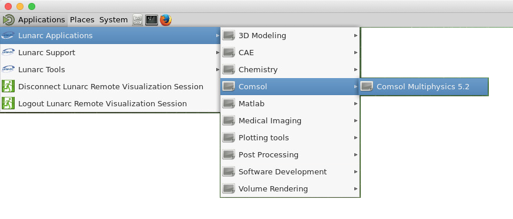
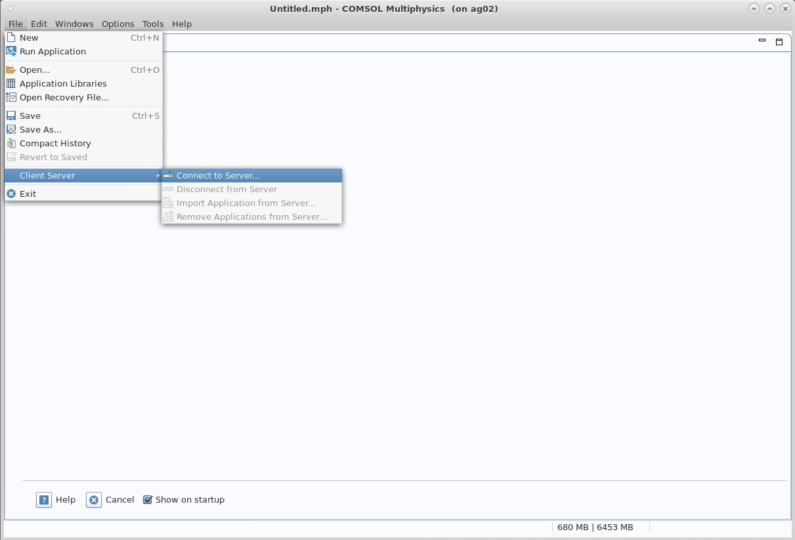
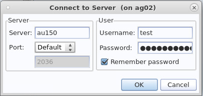

# COMSOL

COMSOL is installed on the cluster. It can either be used non-interactively for running a .mph file by sending it through the queue system from any login node or interactively from the LUNARC desktop. If run interactively, care has to be taken so that the program does not consume large amounts of resources on the frontend.

## Non-interactive use

Given a .mph file comsol is started and run on the backend using a sbatch-script.
an example script is given below:

    #!/bin/bash
    #
    # job time, change for what your job requires In this example 1h 
    #SBATCH -t 1:00:00
    #SBATCH -N 1
    #SBATCH --tasks-per-node=20
    #
    #SBATCH -A <your-project-name>
    # job name
    #SBATCH -J <whatever_name_you_want>
    #
    # filenames stdout and stderr - customise, include %j
    #SBATCH -o process_%j.out
    #SBATCH -e process_%j.err
    #
    # write this script to stdout-file - useful for scripting errors
    cat $0

    # Add modules
    module add comsol

    # run the program 
    # customise for your program name and add arguments if required
    
    comsol batch -inputfile  input.mph -outputfile output.mph 

This will run the job input.mph on the cluster and save the output to output.mph

## Interactive use

To run interactively the LUNARC Desktop (thinlinc) MUST be used. 
The setup is based on having a comsol server process running on the backend which the GUI (which is running on the frontend) connects to.
The first time the comsol server process is started you will be prompted to give a username and a password. NOTE! Do NOT use your LUNARC username and password! invent your own.
This means that the FIRST tome you start the server you MUST do it interactively.

To start an interactive session, start a terminal and type:

    interactive -N1 --exclusive -A <your_project_name> -t 01:00:00

This will give you a new prompt on a node on the cluster for 1h.
To start the server type:

    comsol -np 16 server

This will start a server using 16 processing cores. You can adjust the number of cores to any number up to 20 which is the number of cores on a node.  You should select the number of cores giving you the fastes time to solution, which typically requires some experimentation.

The program will ask you for a username and a password as described above. This username and password will be saved in your .comsol directory in your home directory.
Make a note of which node you are running on (it will be stated in the console as auxxx)

It is now time to start the GUI. As seen in the figure, Comsol is available through the Applications menu on the LUNARC desktop.

  

This will bring up the comsol GUI. In the GUI you must now attach to the server as shown in the following images

  

This will bring up a window where you need to supply which node the server is started on as shown below.

  

Make sure that the server is the one you have started the server on. The username and password are the ones that you selected above, they should be filled in already but if not you have to supply them.
You are now set up to run Comsol using the backend node for calculations. Please note that the comsol process WILL use your core-hours regardless of wheter you are doing calculations or not. So it is a good idea to shut down the server if it is not needed.

Having started the Comsol server once, all of your settings for the server are saved in the directory .comsol on your home directory. Having the settings saved enables you to start the server with an SBATCH-script instead of through the interactive command.
Below is an example on how to start the server through such a script instead.

    #!/bin/bash
    #
    # job time, change for what your job requires   
    #SBATCH -t 1:00:00
    #SBATCH -N 1
    #SBATCH --tasks-per-node=20
    #
    #SBATCH -A <your_project_name>  
    # job name
    #SBATCH -J comsol_server
    #
    #SBATCH --mail-user=you@yourdomain
    #SBATCH --mail-type=START
    #
    #
    # filenames stdout and stderr - customise, include %j
    #SBATCH -o process_%j.out
    #SBATCH -e process_%j.err
    #
    # write this script to stdout-file - useful for scripting errors
    cat $0
    # Add modules
    module add comsol
    # run the program 
    # customise for your program name and add arguments if required 
    comsol -np 20 server

In this script you are using one full node for 1h. you will also receive an email when the job starts so you will know when to connect to the server. 