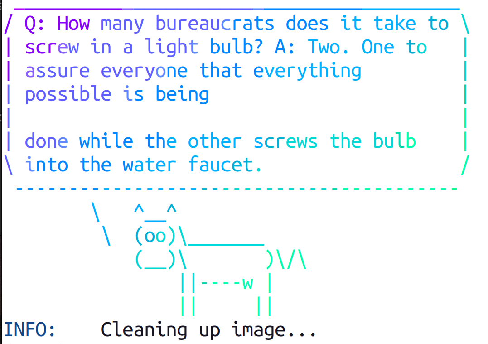

# Running containers on LUNARC using Singularity/Apptainer

A container is a self-contained environment for an application containing all required package dependencies. On LUNARC resources, we aim to provide most scientific software packages using the module system and EasyBuild. However, some applications can be difficult to build or have requirements that cannot be satisfied with a standard LUNARC environment, such as software that requires a specific operating system other than Rocky Linux 9, the OS that COSMOS uses. One solution is to use containers. On LUNARC resources, it is possible to run applications in containers provided by Docker/Singularity repositories or build custom containers using the Singularity/Apptainer environment. (Apptainer is the new name for the non-commercial branch of Singularity, but commands that use the word "singularity" will still work for now.)

Apptainer/Singularity containers are stored in Singularity Image Format (`.sif`) files where the "image" refers to the computing environment contained — this could be anything from a single software package to a full virtual operating system with hundreds of packages. These `.sif` files should be run from your `/home/` directory, which is automatically mounted inside the container along with all its contents.

Singularity/Apptainer commands are available on front-ends and nodes. When you launch the container, it is possible to work as root within it using the `--fakeroot` runtime option, but this does not allow you to escalate your user privileges on data that you do not already have read+write access to outside the container.

## Running premade containers

Singularity/Apptainer can download premade containers for certain programs from online repositories such as DockerHub, Singularity Hub (shub), or cloud.sylabs.io (default library). For example, to download the latest Docker container built around TensorFlow for a GPU:

```bash
apptainer pull tensorflow.sif docker://tensorflow/tensorflow:latest-gpu
```

The documentation for the `apptainer pull` command with all available repository options can be found [in the Apptainer documentation](https://apptainer.org/docs/user/latest/cli/apptainer_pull.html#apptainer-pull).

If you want to run software in a premade container immediately without modification and you know the repository link, you can use `apptainer run <repository://link/to/container>`. This can be useful in a SLURM script for niche software that converts or processes a specialised file format.

A popular test example is the `lolcow` container that prints a colourful ASCII cow with a randomly-generated quote. Build and run it locally with:

```bash
apptainer run docker://godlovedc/lolcow
```

The output during the build process looks like this:

```text
INFO:    Converting OCI blobs to SIF format
INFO:    Starting build...
Getting image source signatures
Copying blob 8e860504ff1e done   |
Copying blob 9fb6c798fa41 done   |
Copying blob 7fac07fb303e done   |
INFO:    Creating SIF file...
```

And the output that follows:



If you receive a container as a definition (`.def`) file, build it with:

```bash
apptainer build path/to/your/container.sif path/to/your/container.def
```

Then run it with:

```bash
./path/to/your/container.sif
```

or with more runtime options:

```bash
apptainer run [-options...] /path/to/your/container.sif [args...]
```

To run only a subset of the programs included in a container, use `apptainer exec`:

```bash
apptainer exec [-options] /path/to/your/container.sif [commands...]
```

To open a shell within the container:

```bash
apptainer shell ./path/to/your/container.sif
```

Inside the shell, only the programs installed inside the container are available.

## Building your own containers

If you need a more complex environment, create your own definition (`.def`) file and use the `build` command to convert it to an executable `.sif` file.

### Parts of a Definition File

There are two main parts to any definition file:

1. The **Header**, which describes the OS that the contained software is to run within and where the template for that OS kernel is located. The header must include a `Bootstrap` key-value pair, which determines which other key-value pairs must be included. The full list of available bootstrap agents can be found [in the Apptainer documentation](https://apptainer.org/docs/user/latest/definition_files.html#preferred-bootstrap-agents).

2. **Sections**, which include all other code needed to build the container. Each section must be prefaced with a title starting with `%`, like `%post` or `%environment`. All sections are optional and there can be more than one instance of each section. Sections run at build time are executed with the `/bin/sh` interpreter. The most important sections are:

    - `%files` — copy files into the container. Note that Apptainer as configured on our system mounts your home directory, so files there do not need to be copied into the container.
    - `%post` — commands to download and install software into the container. Environmental variables that must be defined at *build* time are also placed here.
    - `%environment` — set *runtime* environmental variables to be used in the container.
    - `%runscript` — written to a dedicated file at build time; its contents execute when the container is run directly. Any options passed upon running the container will be passed to `%runscript`.

Once the definition file is finished, run the `build` command to create the `.sif` file. Running the container is then the same as described for premade containers.

For more information on using containers, see:

- [UPPMAX Singularity Workshop](https://pmitev.github.io/UPPMAX-Singularity-workshop)
- [Apptainer Documentation](http://apptainer.org/)
- [Singularity Documentation](https://sylabs.io/singularity/)
- [Example Apptainer Definition Files](https://github.com/apptainer/apptainer/tree/release-1.3/examples)

---

**Author:**
(LUNARC)

**Last Updated:**
2025-09-08
