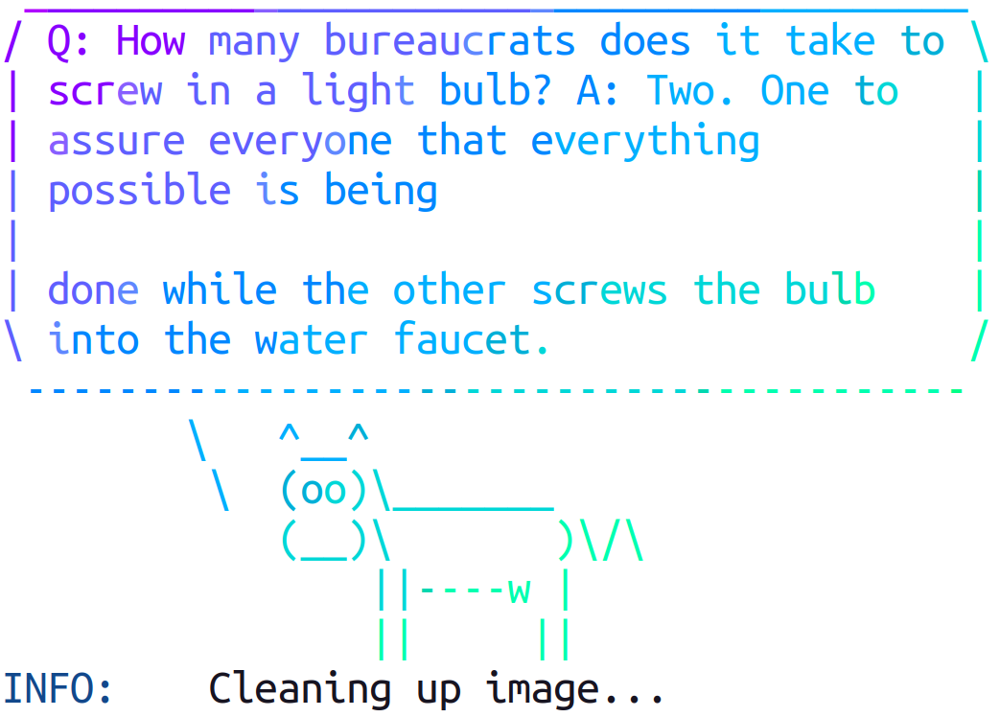

# Running containers on LUNARC using Singularity/Apptainer

A container is a self-contained environment for an application containing all required package dependencies. On LUNARC resources, we aim to provide most of our scientific software packages using the module system and EasyBuild. However, some applications can be difficult to build or have requirements that can't be satisfied with a standard LUNARC environment, such as software that requires a specific operating system (OS) other than Rocky Linux 9, the OS that COSMOS uses. One solution for this is to use containers. On LUNARC resources, it is possible to run applications in containers provided by Docker / Singularity repositories or build custom containers using the Singularity / Apptainer environment. (Apptainer is the new name for the non-commercial branch of Singularity, but commands that use the word "singularity" will still work for now.)

Apptainer/Singularity containers are stored in Singularity Image Format (.sif) files where the "image" refers to the computing environment contained, which could be any set of software and associated configuration settings from a single software package to a full virtual operating system with hundreds of packages. These .sif files should be run in your `/home/` directory, which will automatically `/home/` and all its contents inside the container. 

Singularity/Apptainer commands are available on front-ends and nodes. When you launch the container, it is possible to work as root within it using the `--fakeroot` runtime option, but this does not allow you to escalate your user privileges on data that you do not already have read+write access to outside the container.

## Running premade containers
Singularity / Apptainer can download premade containers for certain programs from online repositories, like DockerHub, Singularity Hub (shub), or cloud.sylabs.io (default library). For example, let's say you want to download the latest Docker container built around TensorFlow for a GPU. This is the command you would use to download that container:

`$ apptainer pull tensorflow.sif docker://tensorflow/tensorflow:latest-gpu`

The documentation for the `apptainer pull` command with all avilable repository options can be found [at this link.](https://apptainer.org/docs/user/latest/cli/apptainer_pull.html#apptainer-pull)

If you want to run software in a premade container immediately without modification and you know the repository link, you can run it with the command `apptainer run <repository://link/to/container>`. You might, for example, include this as a line in your slurm script if you know of a niche software package that converts or performs a fixed function on some highly specialized file format, and it's not worth requesting it as an installation on COSMOS.

A popular test example is the `lolcow` container that prints a colorful ASCII character rendering of cow with a randomly-generated funny or witty joke. Here is the command that builds and runs the container locally:

`$ apptainer run docker://godlovedc/lolcow`

The output during the build process looks like this:
```
INFO:    Converting OCI blobs to SIF format
INFO:    Starting build...
Getting image source signatures
Copying blob 8e860504ff1e done   | 
Copying blob 9fb6c798fa41 done   | 
Copying blob 7fac07fb303e done   | 
Copying blob d010c8cf75d7 done   | 
Copying blob 9d99b9777eb0 done   | 
Copying blob 3b61febd4aef done   | 
Copying config 38dc06177c done   | 
Writing manifest to image destination
INFO:    Creating SIF file...
INFO:    squashfuse not found, will not be able to mount SIF or other squashfs files
INFO:    fuse2fs not found, will not be able to mount EXT3 filesystems
INFO:    gocryptfs not found, will not be able to use gocryptfs
INFO:    Converting SIF file to temporary sandbox...
```

And the output that immediately follows looks like this:


If you download or receive a container in the form of a definition (.def) file, you will need to run:

`$ apptainer build path/to/your/container.sif path/to/your/container.def`

This creates the .sif file, which you can then run via:

`$ ./path/to/your/container.sif`

or, for more runtime options,

`$ apptainer run [-options...] /path/to/your/container.sif [args...]`.

If you only want to run a subset of the programs included in a container, you can also do that with the `apptainer exec` command and specify just the commands you want to run at the end, like so:

`$ apptainer exec [-options] /path/to/your/container.sif [commands...]`.

You can also open a shell within your container to run a subset of the software contained. To do that, run
`$ apptainer shell ./path/to/your/container.sif`.
Keep in mind that inside the shell, the only programs available are the ones installed inside the container. For example, the lolcow container above contains only 3 programs: lolcow (which draws the cow), fortune (which generates the quote), and toilet (which colors all of the characters with a rainbow gradient). If you opened a shell inside the lolcow container, those 3 programs are the only programs you could execute.

## Building your own containers
If you have to create a more complex environment, you may need to create your own definition (.def) file and then use the `build` command to convert it to an executable .sif file.

### Parts of a Definition File
There are two main parts to any definition file, each of which contains several elements:

1. The **Header**, which describes the OS that the contained software is to run within and where the template for that OS kernel is located. The header must include a `Bootstrap` key-value pair, which determines which other key-value pairs must be included in the header. The full list of available bootstrap agents can be found [in this section of the Apptainer documentation](https://apptainer.org/docs/user/latest/definition_files.html#preferred-bootstrap-agents). The other keywords made available with the use of each agent can be found by clicking the name of the bootstrap agent, if it is highlighted as a hyperlink.
   
2. **Sections**, which include all other code needed to build the container. Each section must be prefaced with a title, all lower-case, that starts with `%`, like `%post` or `%environment`. All sections are optional and there can be more than one instance of each section in one .def file. Sections run at build time are executed with the `/bin/sh` interpreter and accept `/bin/sh` options. The full list of available sections can be found [in the Sections chapter of the Apptainer documentation](https://apptainer.org/docs/user/latest/definition_files.html#sections). The most important sections you are likely to use are:
   
   - `%files`: this section lets you copy files into the container. Note that Apptainer as configured on our system mounts your home directory, so files there do not need to be copied into the container.
     
   - `%post`: this section is where you give the commands to download and install software into the container. By default, the commands will be in either `sh` or `bash`, but if you wanted to change the shell language to, for example, `tcsh`, you could start the section as `%post -c tcsh`. Environmental variables that must be defined at *build* time must also be placed here.
     
   - `%environment`: this section lets you set *runtime* environmental variables to be used in the container. Environmental variables are not copied from the host, but some may be set within the container by any software installations done in `%post`.

   - `%runscript`: this section is written to a dedicated file at build time and then, at run time, its contents execute when the container is run directly. Any options passed upon running the container will be passed to `%runscript`. Very often this section will contain a line that says something like ` <app_name> "$@" `. The `"$@"` expands all the arguments passed after the container name in `apptainer run <container> [args...]` and forwards them to the program executed inside the container at runtime.
  
Once the definition file is finished, you can just run the `build` command to create the .sif like you would for a premade .def file. Once you have the .sif file, running the container is the same as described for premade containers.

For more information on how to use containers, please see the following links:

[UPPMAX Singularity Workshop](https://pmitev.github.io/UPPMAX-Singularity-workshop)

[Apptainer Documentation](http://apptainer.org/)

[Singularity Documentation](https://sylabs.io/singularity/)

[Example Apptainer Definition Files](https://github.com/apptainer/apptainer/tree/release-1.3/examples)

Singularity/Apptainer commands are available on front-ends and nodes.
