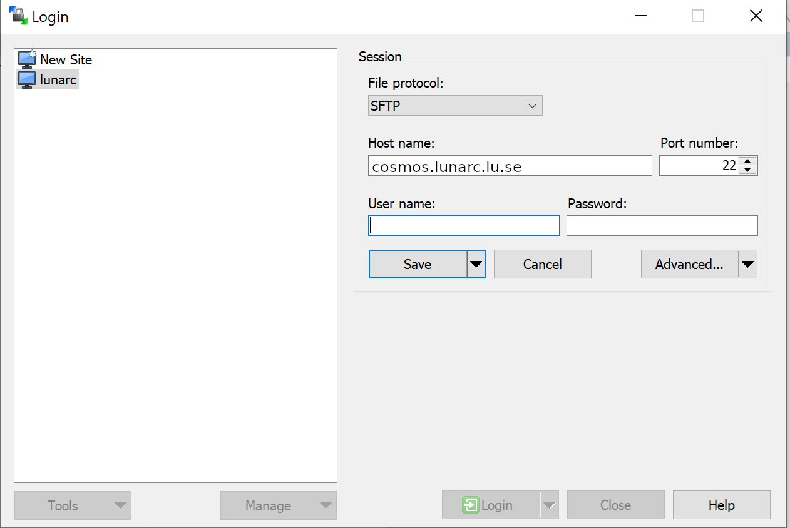

# WinSCP

The default file transfer method in WinSCP is SFTP, so no special settings is needed for this. Just make sure that the "File protocol" setting is set to SFTP as shown in the following figure:

To reduce the number of logins to the system the "Keepalive" options can be set as shown in the following figure:

!!! info

    The "Advanced options" checkbox must be checked to access these settings

