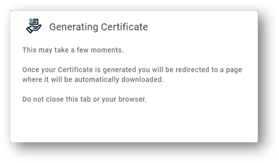

# Requesting a certificate for Swestore

To be able to access Swestore resources through command line tool a user certificate is required. Most universities have services for requesting a user certificate. At Lund university it is possible through the certificate-manager provivided by Sectigo.

Your identity must fulfill the requirements for requesting personal certificates, within Sweden the requirement is SWAMID Assurance Level 2 Profile (SWAMID AL2), or higher. At Lund university this is done when you identify youself when you get a LU-card.

!!! info

    The use of a certificate is required if you want to use more advanced command line tools such as the ARC clients or rclone software directly on the LUNARC resources.

## Requesting a certificate from the Sectigo portal

A certificate can be requested by going to the following URL of the sectigo portal:

[https://cert-manager.com/customer/sunet/idp/clientgeant](https://cert-manager.com/customer/sunet/idp/clientgeant)

Select Lund university:


Log in using your LUCAT-id:


Make sure the settings look something like the following page before clicking **Submit**.


After submitting the request the private key is generated and the following image is displayed:



When all has been completed a certs.p12 file has been generated that contains your signed certificate.

## Installing certificate in browser

Many services require that your certficate is installed in the browser. Please see the following link for more information on how to do this:

[http://docs.snic.se/wiki/Requesting_a_grid_certificate_from_the_Nordugrid_CA#Installing_the_certificate_in_your_browser](http://docs.snic.se/wiki/Requesting_a_grid_certificate_from_the_Nordugrid_CA#Installing_the_certificate_in_your_browser)

## Register certificate with SUPR

To be able to use clients that require certificate, your certificate must be registered in SUPR. This is described in the following link:

[https://supr.snic.se/person/prepare_register_certificate/](https://supr.snic.se/person/prepare_register_certificate/)

## Prepeare certificate for ARC

To use the .p12 certificate with the ARC command line tools it has to be converted to a different format. To separate files have to be created:

 * usercert.pem - Certificate public key
 * userkey.pem - Certificate private key

The private key is a file that needs to be kept secret and not shared with anyone.

The ARC client expect the keys to be stored in the users home directory in a folder called **./arc**. This folder can be created and protected using the following commands:

```bash
$ cd
$ mkdir ~/.arc
$ chmod 0700 ~/.arc
```

The certificate is the extracted with the following commands:

```bash
$ openssl pkcs12 -nocerts -in ~/certs.p12 -out ~/.arc/userkey.pem
Enter Import Password:
MAC verified OK
Enter PEM pass phrase:
Verifying - Enter PEM pass phrase:
```

The import password is the password given when exporting the .p12 from the Sectigo portal. In the **Enter PEM pass phrase:** prompt a password for the private key is given. This protects the private key being used by other users.

The public key is extracted in a similar way:

```bash
$ openssl pkcs12 -clcerts -nokeys -in ~/certs.p12 -out ~/.arc/usercert.pem
Enter Import Password:
MAC verified OK
```

Before we can use our certificates with the ARC tools it has to be protected in the filesystem using the following commands:

```bash
chmod 0400 ~/.arc/userkey.pem
```

## Creating a proxy certificate

To access swestore resources using command line tools such as ARC clients or rclone requires a short lived certificate called a proxy certificate. Creating a proxy certificate is done using the **arcproxy** command on the LUNARC resources.

During the life time of the proxy certificate all storage resources can be accessed without the need to enter a username or password.

On LUNARC resources a proxy certificate is created using the following command:

```bash
$ arcproxy
Enter pass phrase for private key:
Your identity: /DC=org/DC=terena/DC=tcs/C=SE/O=Lunds universitet/CN=Jonas Lindemann bygg-jli@lu.se
Proxy generation succeeded
Your proxy is valid until: 2022-03-15 09:16:12
```

## Displaying proxy information

Information on proxy lifetime can be shown using the **arcproxy -I** command:

```bash
$ arcproxy -I
Subject: /DC=org/DC=terena/DC=tcs/C=SE/O=Lunds universitet/CN=Jonas Lindemann bygg-jli@lu.se/CN=1985496675
Issuer: /DC=org/DC=terena/DC=tcs/C=SE/O=Lunds universitet/CN=Jonas Lindemann bygg-jli@lu.se
Identity: /DC=org/DC=terena/DC=tcs/C=SE/O=Lunds universitet/CN=Jonas Lindemann bygg-jli@lu.se
Time left for proxy: 11 hours 56 minutes 19 seconds
Proxy path: /tmp/x509up_u424
Proxy type: X.509 Proxy Certificate Profile RFC compliant impersonation proxy - RFC inheritAll proxy
Proxy key length: 2048
Proxy signature: sha384
```

---

**Author:**
(LUNARC)

**Last Updated:**
2022-10-05