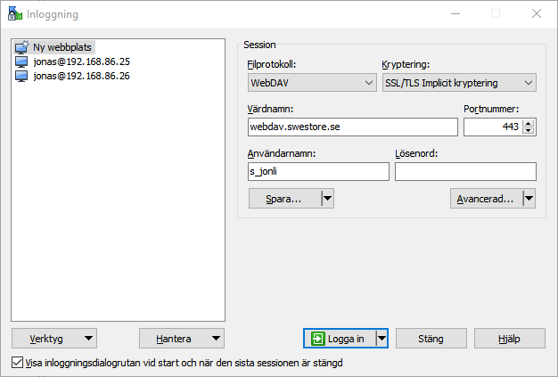
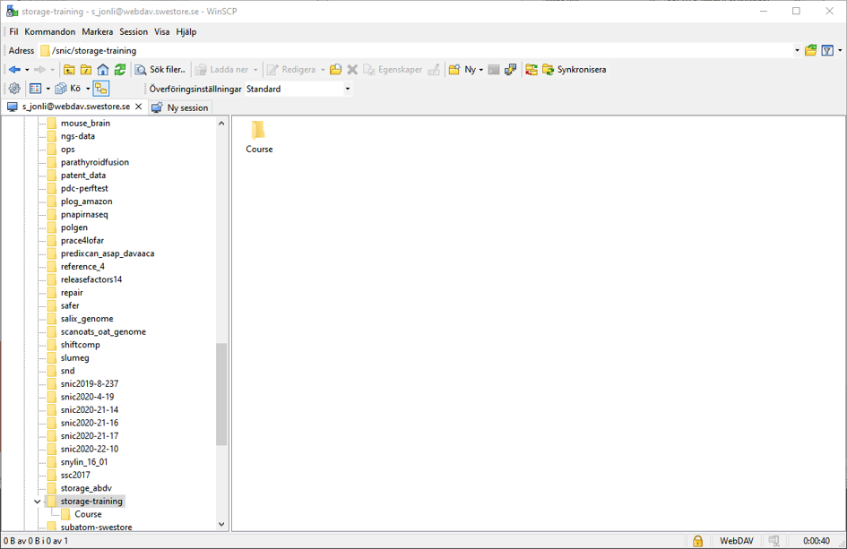
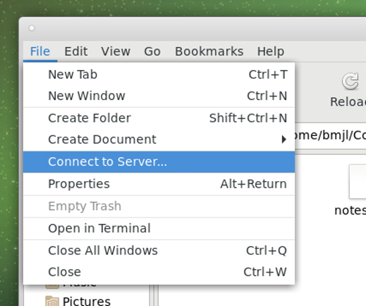
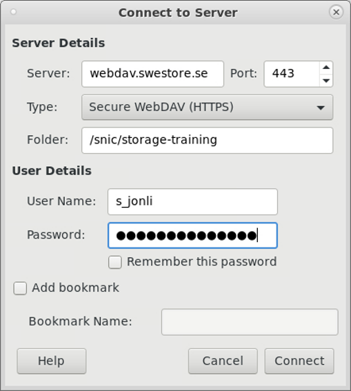
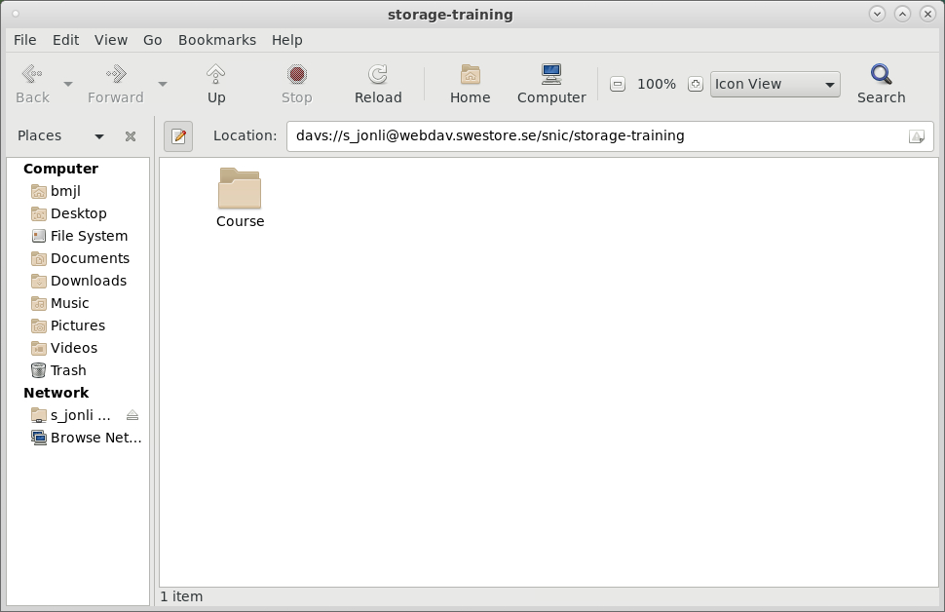

# Mounting Swestore (Windows)

The Swestore can be accessed directly using the WinSCP application. A connection can be established using the following settings:

!!! warning

    Don't check the option **Remember this password** as this will store your password in an easy to readable file in the filesystem.

Clicking **Log in** will open a file browser windows against your home directory on Swestore. 

It is now possible to transfer files to and from Swestore.

# Mounting Swestore (Linux)

It is possible to mount the Swestore storage infrastructure as a drive on Linux. This enables you to access Swestore both on your own computer as well as directly on the LUNARC HPC Desktop. 

To mount the file system open a file browser window. Select **File/Connect to Server...**

Next add your Swestore credentials in the shown dialog box:

!!! warning

    Don't check the option **Remember this password** as this will store your password in an easy to readable file in the filesystem.

To mount the file system click **Connect**. This will bring up a new file window of the Swestore file system.

It is now possible to transfer files to and from Swestore.

---

**Author:**
(LUNARC)

**Last Updated:**
2022-10-05