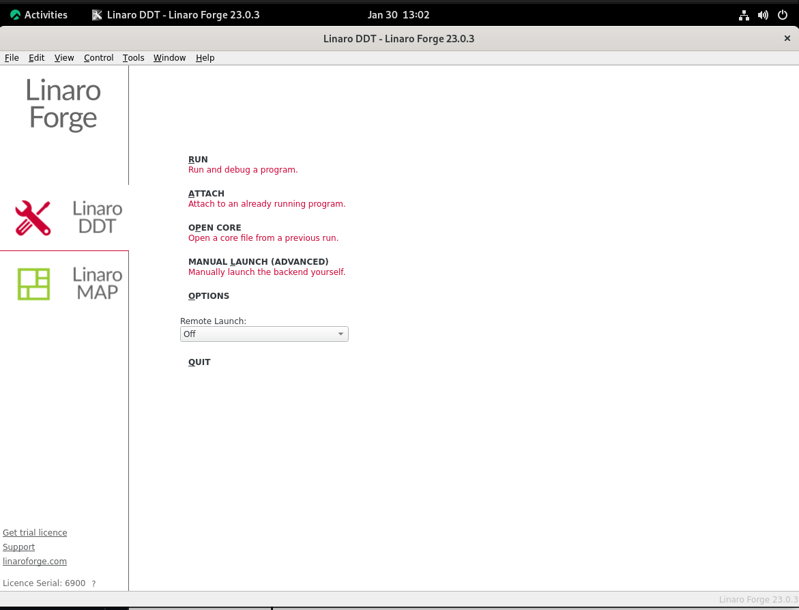
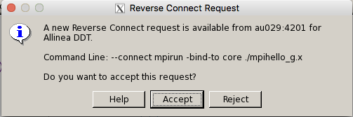
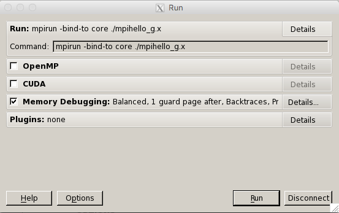
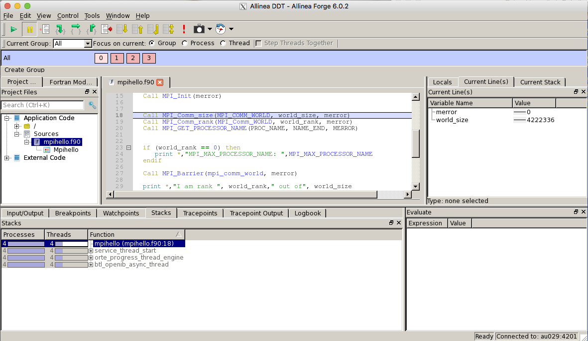
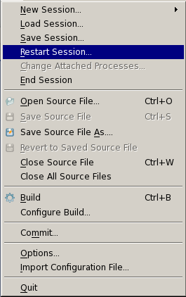
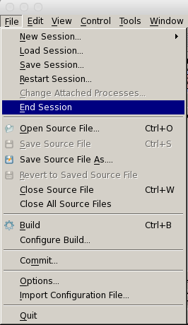

# DDT debugger on COSMOS

A basic description on how to start a debugging session with DDT, part of [Linaro Forge](https://www.linaroforge.com/), on the COSMOS cluster.  Job will be submitted through the Slurm batch system to the back-end nodes.

## About this document

This document gives basic instruction on how to start a debugging session using the DDT debugger on the COSMOS cluster at LUNARC.  This document is based on Linaro DDT version 23.0.3 currently installed on COSMOS.  There is currently a centralised NAISS license hosted by NSC.  The licenses are shared between the users of all NAISS systems, so please be considerate of other users regarding how many licenses you use (time and number of cores).
    
DDT is a powerful debugger for serial and parallel programs.  The tool is developed and maintained by Linaro, (formerly ARM and ALLINEA).  It is part of the Linaro Forge suite.  A number of parallel programming models are supported.  This includes MPI, OpenMP and a number of GPU languages.  This document is not a DDT userguide, we refer our users to the documentation available from the [Linaro website](https://docs.linaroforge.com/23.1.1/html/forge/index.html), in particular their [DDT user guide](https://docs.linaroforge.com/23.1.1/html/forge/forge/introduction_to_forge/ddt.html).

## Getting started with DDT on COSMOS

### Connect to COSMOS via the LUNARC HPC desktop

To use DDT you need to be able to access its graphical user interface (GUI).  
The recommended way to connect to the system is via the [LUNARC HPC desktop](../../getting_started/using_hpc_desktop.md), which uses Thinlinc.  

<!--
### Using x-forwarding under Linux or on a Mac
Linux systems are typically setup to support x-windows.  On the latest releases of Mac OSX you have to install [XQuartz](http://www.xquartz.org/) to display x-windows.  Once this is available connect to COSMOS:

    ssh -X cosmos-dt.lunarc.lu.se -l <username>
    
You will be prompted for password and one-time-password as usual.

### Connecting from a windows system
To connect using x-forwarding from a windows it is recommended to install [Cygwin](https://www.cygwin.com/). 
-->

### Starting the DDT GUI on COSMOS

LUNARC currently recommends using *reverse connect* to start DDT.  Load the relevant module.  On COSMOS the module name is *linaro_forge*.  Load it with: 

```
    module load linaro_forge
``` 
   
You can now start the GUI by typing

```
    ddt &
```    

at the command prompt.  This will bring up the following GUI window

    

In the bottom left hand corner you get confirmation whether you managed to reach the license server at NSC.

#Preparing and running your executable
We have seen issues when sources and/or executables are placed on the /lunarc file system (nobackup space).  Copying sources and executables into your home space typically solves the issues.

You need to prepare your executable for debugging.  Please **recompile** and **relink** everything with debugging support and without optimisation.  To do so, for most compilers you need to add the flags

```
   -g -O0
```

Once your created an executable with debugging support, run it using either a batch script or an interactive session.  

Make sure the `linaro_forge` module and all other modules needed to run your executable (GCC, OpenMPI, SciPy-bundle, ...) are loaded by your script or manually inside your session, before starting the executable.

To start your program, prefix the execution statement with `ddt --connect`.  For example an MPI code compiled against an OpenMPI-library should be started as follows

```
   ddt --connect mpirun program_g
```

with the executable being named *program_g*. If you are using `mpi4py`, between `mpirun` and the name of your executable, you will need to insert ` python3 %allinea_python_debug% `. In case of the Intel MPI-library the code gets started using *srun*

```
   ddt --connect srun program_g
```

Once your job starts running, you will get a request to allow your job connecting to the DDT GUI

     

Accept this to get to the next window.



In this window you can select the features of ddt which you require.  We would like to point out the **Memory Debugging**, which can be extremely useful when trying to resolve segmentation faults and memory leaks.  Please consult Allinea's user guide for more details and side effects (e.g. increased memory consumption) of using this feature.

Hit the *run* button to start the debugger window



In the GUI you can run your code (parallel or serial), set breakpoints, examine values of variables and data structures.  

During a debugging job it is often required to restart the program execution from the beginning.  We recommend not to choose the *Restart Session* option from the *File* pull down menu to restart the programs execution from the beginning:

 

In particular when using DDT from a batch script, using this option will keep your script active and **you do not need to re-queue**.
  
If you want to start over for e.g. changing the level of memory debugging, we recommend using the *End Session* option from the File pull down menue:



Using this option will terminate the ddt execution, but keep the GUI alive, which is often advantageous when using *ssh -X* to connect to the cluster.  If working from a batch script, its execution will then continue to the next line(s) which typically leads to the script finishing and requires you to re-queue.  An interactive session will keep running, if the time limit has not been reached.

 
<!-- # Debugging MPI code on Alarik #

If you now select the "Run and Debug a Program" option you get to the following screen:

DDT_run_window_5.0.1 **PLEASE FIX***

In this window you can select your executable, tell DDT any command line arguments, select input file and working directories. Make sure the "MPI" box is ticked.  Inside the MPI box, you can select the number of processors needed - the examples shows 4 processes.  DDT will not allow you to ask for more processes than the number of licenses currently available.  We highly recommend to use as small a number of processors as possible to reduce the complexity of the debugging task.

Check the box "Submit to Queue".  The default is for a debugging session of up to 30 minutes.  You can change that by selecting the "Parameters" button associated with "Submit to Queue".  You get the following dialog:

DDT_run_window_5.0.1 **PLEASE FIX***

This also allows to change the wall clock time and the memory per task setting.  We have set initial values for the memory, matching on the systems configuration to minimise waiting time and cost allocated to your account.  On Alarik, if you increase your memory beyond 2000, please also check the box requiring 64 GB nodes. Uncheck that box if your memory per task is 2000 MB or less.  If you increase this setting, your debugging jobs may spent more time before they become active and might be more expensive with regard to your allocation.  DDT will remember changes made.  You must manually reset this to the recommended value if you don't need this any longer.  The recommended values are:

| System | recommended |
|-----------------|-------------|
| memory per task |  |
| Alarik | 2000 |
| Erik | 4000 |
 
In the box "Queue options" you can specify any sbatch option you like.  The example specifies an account (required only if your user-id is linked to multiple projects) and placement in the test queue.

Once everything is set, hit "Submit". 

DDT will then write a Slurm script for you and submit it to the batch queue.  While waiting in the queue, DDT will display the job queue.  Once your job starts running you get the DDT working window:

DDT_working_window_5.0.1 **PLEASE FIX***

You can now start your debugging session.  The DDT User Guide describes the options for running and debugging the program. 

Once your debugging session is finished you will find an output file in your directory.  This is named: ddt_jobid.out with jobid denoting the job-id number.  This file contains the output of your program to stdout and stderr.  You might want to clean your directory after the debugging has finished.
# Debugging of GPU code on Erik

Here we describe the changes needed from the above to debug code on the GPU.  To facilitate GPU debugging for CUDA code one has to add the flags

    -g -G

to the options of the nvcc compiler. If you select "Run and debug a program" you get the following dialog:

DDT_cudarun_5.0.1

You have to check the "CUDA" box and the "Submit to Queue" boxes.  You can change the queue parameters by clicking on the "Parameters" button associated with "Submit to Queue".  You get the following dialog:

Erik_queue_parameters_5.0.1

Here we have selected 30 minutes of time, the default memory and the test partition.  After submission, you get into the job queue and once starting, you get to the working window.  When working on a source line executed on the GPU, the working window looks similar to:

DDT_working_window_gpu_5.0.1
Workflow

To improve the workflow and reduce time spent in the job queue waiting for processors becoming available, it is recommendable to ask for considerable amount of time, 30 min or more.  During this time you can restart your application as many times as needed (Tab: File -> Restart Session).  To release the resources use the Tab: File -> New Session -> Run.  This will release the cpus held by your debugging job and get you back to the window where you can change one or more of: selected executable, number of processes, wall time etc.  Your account gets charged for the resources consumed from when your debugging session became active until you released the cpus.
Resetting DDT

DDT remembers settings from your previous debugging sessions and also failed attempts.  Removing all DDT history can be achieved by deleting the directories .ddt and/or .allinea in your home space. 

-->

---

**Author:**
(LUNARC)

**Last Updated:**
2022-10-05
