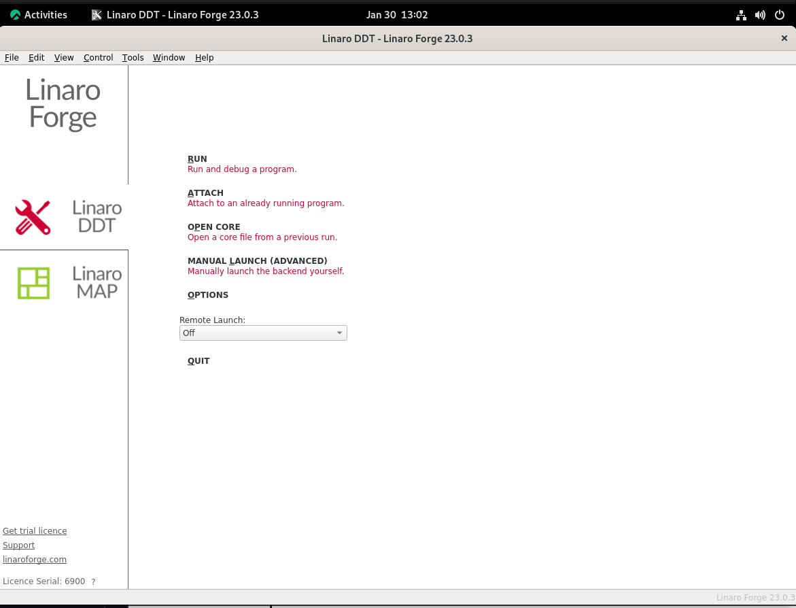
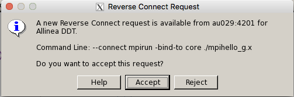
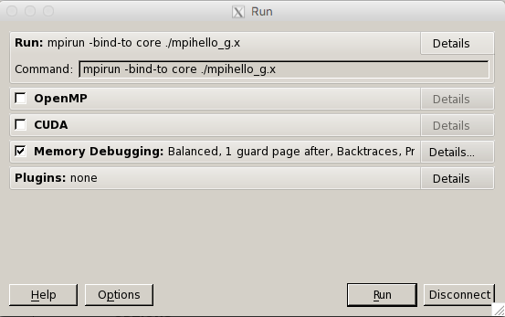
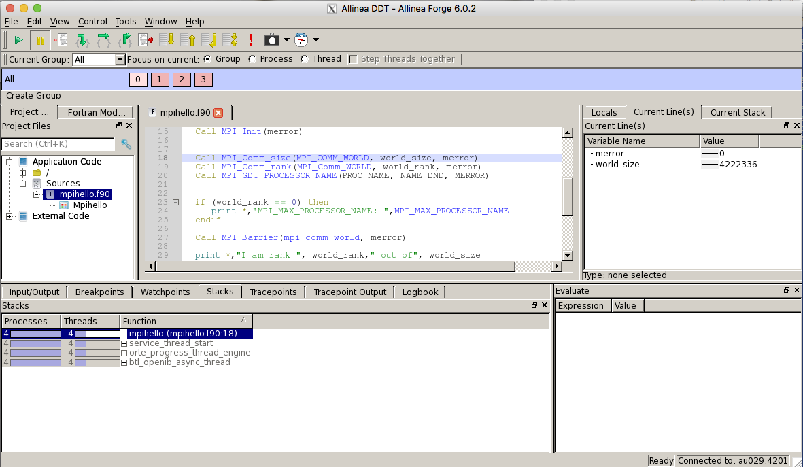
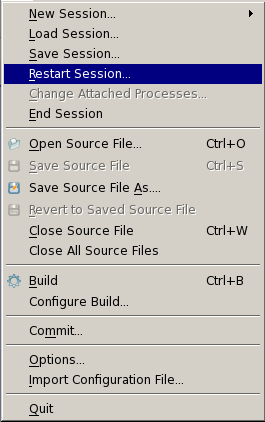
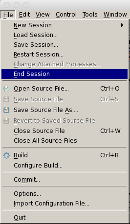

# DDT debugger on COSMOS

!!! warning "Not available on COSMOS"
    DDT is part of Linaro Forge and uses a centralised NAISS license hosted at NSC. This license is restricted to NAISS resources and **cannot be used on COSMOS**. This page is retained for reference only.

    If you need a parallel debugger, contact [LUNARC support](https://supr.naiss.se/support/?centre_resource=c5) to discuss available options.

A basic description on how to start a debugging session with DDT, part of [Linaro Forge](https://www.linaroforge.com/), on the COSMOS cluster. Jobs are submitted through the SLURM batch system to the back-end nodes.

## About this document

This document gives basic instructions on how to start a debugging session using the DDT debugger on the COSMOS cluster at LUNARC. It is based on Linaro DDT version 23.0.3 currently installed on COSMOS. There is a centralised NAISS license hosted by NSC. The licenses are shared between the users of all NAISS systems, so please be considerate of other users regarding how many licenses you use (time and number of cores).

DDT is a powerful debugger for serial and parallel programs. The tool is developed and maintained by Linaro (formerly ARM and ALLINEA) and is part of the Linaro Forge suite. Supported parallel programming models include MPI, OpenMP, and a number of GPU languages. This document is not a DDT user guide — see the [Linaro website](https://docs.linaroforge.com/23.1.1/html/forge/index.html) and in particular their [DDT user guide](https://docs.linaroforge.com/23.1.1/html/forge/forge/introduction_to_forge/ddt.html).

## Getting started with DDT on COSMOS

### Connect to COSMOS via the LUNARC HPC desktop

To use DDT you need access to its graphical user interface (GUI). The recommended way to connect is via the [LUNARC HPC desktop](../../../getting_started/using_hpc_desktop), which uses ThinLinc.

### Starting the DDT GUI on COSMOS

LUNARC currently recommends using *reverse connect* to start DDT. Load the relevant module — on COSMOS the module name is `linaro_forge`:

```bash
module load linaro_forge
```

You can now start the GUI by typing:

```bash
ddt &
```

at the command prompt. This will bring up the following GUI window:



In the bottom left-hand corner you get confirmation of whether you managed to reach the license server at NSC.

## Preparing and running your executable

We have seen issues when sources and/or executables are placed on centre storage rather than the home filesystem. Copying sources and executables into your home directory typically solves these issues.

You need to prepare your executable for debugging. Please **recompile** and **relink** everything with debugging support and without optimisation. For most compilers you need to add the flags:

```bash
-g -O0
```

Once you have created an executable with debugging support, run it using either a batch script or an interactive session.

Make sure the `linaro_forge` module and all other modules needed to run your executable (GCC, OpenMPI, SciPy-bundle, ...) are loaded by your script or manually inside your session before starting the executable.

To start your program, prefix the execution statement with `ddt --connect`. For example, an MPI code compiled against an OpenMPI library should be started as follows:

```bash
ddt --connect mpirun program_g
```

where the executable is named `program_g`. If you are using `mpi4py`, insert ` python3 %allinea_python_debug% ` between `mpirun` and the name of your executable. For the Intel MPI library, use `srun` instead:

```bash
ddt --connect srun program_g
```

Once your job starts running, you will get a request to allow your job to connect to the DDT GUI:



Accept this to get to the next window:



In this window you can select the DDT features you require. We highlight **Memory Debugging**, which can be extremely useful when resolving segmentation faults and memory leaks. Consult the Linaro user guide for details and side effects (e.g. increased memory consumption) of using this feature.

Hit the *Run* button to start the debugger window:



In the GUI you can run your code (parallel or serial), set breakpoints, and examine values of variables and data structures.

During a debugging job it is often necessary to restart the program execution from the beginning. We recommend using the *Restart Session* option from the *File* pull-down menu:



In particular when using DDT from a batch script, using this option will keep your script active and **you do not need to re-queue**.

If you want to start over — for example to change the level of memory debugging — use the *End Session* option from the File pull-down menu:



Using this option will terminate the DDT execution but keep the GUI alive. If working from a batch script, execution will continue to the next line(s), which typically causes the script to finish and requires you to re-queue. An interactive session will keep running if the time limit has not been reached.

---

**Author:**
(LUNARC)

**Last Updated:**
2022-10-05
