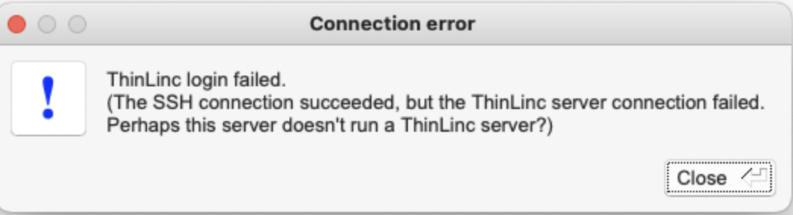

# Frequently asked questions - Login

## I have forgotten my login password

Visit the password self-service portal and identify yourself with your email address and the mobile phone registered in [SUPR](https://supr.naiss.se/person/):

[Password self-service portal](https://phenix3.lunarc.lu.se/pss){ .md-button }

If this fails, call LUNARC support on **+46 (0)46-222 4454** from your registered mobile phone. Additional questions will be asked to verify your identity.

## I cannot log in after installing a Pocket Pass token

This is almost always caused by missing the [final activation step](../../getting_started/authenticator_howto.md#step-5-activate-your-token). To activate your token, go to the [self-service portal](../../getting_started/authenticator_howto.md#step-2-accessing-the-self-service-portal), open the **Tokens** tab, choose **Activate**, and follow the instructions.

## I have persistent problems connecting after entering my One Time Password (OTP)

Your Pocket Pass token may have expired. Check the [expiration status](../../getting_started/authenticator_howto.md#checking-the-validity-of-your-token) of your token and register a new one if needed.

## I do not get prompted for a One Time Password (OTP) after entering my password

Make sure you entered the correct password — reset it at the [password self-service portal](https://phenix3.lunarc.lu.se/pss) if unsure. If the problem persists, your Pocket Pass token may need to be re-registered. Visit the [self-service portal](../../getting_started/authenticator_howto.md#step-2-accessing-the-self-service-portal) to do so.

## My ThinLinc login is failing ("The SSH connection succeeded, but the ThinLinc server connection failed")

You are most likely using the wrong server name:

| Method | Server |
| --- | --- |
| SSH | `cosmos.lunarc.lu.se` |
| ThinLinc (HPC Desktop) | `cosmos-dt.lunarc.lu.se` |

## Can you send my one-time password to my new mobile phone number?

Update your phone number in [SUPR](https://supr.naiss.se/person/) first, then raise a [support request](https://supr.naiss.se/support/?problem_type=accessing&centre_resource=c5&summary=Update+my+contact+information) so LUNARC can update its internal database.

---

**Author:**
Joachim Hein (LUNARC)

**Last Updated:**
2024-11-13 (Marcos Acebes)
